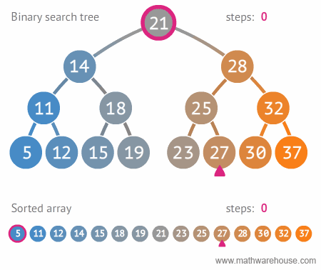

# Source

[[Article] A bug was found in Java after almost 9 years of hiding](https://dev.to/matheusgomes062/a-bug-was-found-in-java-after-almost-9-years-of-hiding-2d4k)

# Intro

I was learning about binary search trees in the [Coursera](https://www.coursera.org/learn/algorithms-part1/home/welcome) when the professor comes up with the story when a bug was found after 9 years of using binary search implementation on Java in 2006. It was  only found when someone was using large values of the int variables low  and high. Let me explain.

# First things first! 🤓

## What is a binary search tree?

According to Wikipedia, a binary search tree (BST) is 

> [...] A particular type of container: a data structure that stores  "items" in memory. They allow fast lookup, addition, and removal of  items, and can be used to implement either dynamic sets of items or  lookup tables that allow finding an item by its key. They keep their  keys in sorted order so that lookup and other operations can use the  principle of binary search: when looking for a key in a tree, they  traverse the tree from root to leaf, making comparisons to keys stored  in the nods of the tree and deciding, based on the comparison, to  continue searching in the left or right subtrees. This means, that on  average each comparison allows the operations to skip about half of the  tree.

Ok, but can we summarize? Of course! Imagine a tree where every  element is sorted, to search in it we need to check, from the root, if  the element is less or greater than the start. If it's less, we go left, if it's greater we go right.

Let's use the example in the gif. We need to search the number 27; 21 is the root, so let's start there.

- Is 27 greater or equal than 21? Yes, so go right. 
- Is 27 greater or equal than 28? No, so go left. 
- Is 27 greater or equal than 25? No, so go right.
- Is 27 greater or equal than 27? Yes, we found it!



The gif also shows a comparison to a sorted array search. We see that BST is much faster!

Ok, now let's see the implementation of the BST

```java
public static int binarySearch(int[] a, int key) {
    int low = 0;
    int high = a.length - 1;

    while (low <= high) {
        int mid = (low + high) / 2;
        int midVal = a[mid];

    if (midVal < key)
        low = mid + 1;
    else if (midVal > key)
        high = mid - 1;
    else
        return mid; // key found
    }
    return -(low + 1);  // key not found.
}
```

This a standard binary search in Java, this was written in the java.util.Arrays.

Looking from different angles is hard to find the bug, actually, it's correct, but not actually... Ok, let me explain...

# The bug 👨‍💻

The bug is in the mathematical details of this line:

```java
int mid =(low + high) / 2;
```

But why?

Well, according to Joshua Bloch in his [article](https://ai.googleblog.com/2006/06/extra-extra-read-all-about-it-nearly.html),

> In *Programming Pearls* Bentley says that the analogous line  "sets m to the average of l and u, truncated down to the nearest  integer." On the face of it, this assertion might appear correct, but it fails for large values of the int variables low and high. Specifically, it fails if the sum of low and high is greater than the maximum  positive int value (231 - 1). The sum overflows to a negative value, and the value stays negative when divided by two. In C this causes an array index out of bounds with unpredictable results. In Java, it throws  ArrayIndexOutOfBoundsException.
>
> This bug can manifest itself for arrays whose length (in elements) is 230 or greater (roughly a billion elements). This was inconceivable  back in the '80s, when *Programming Pearls* was written, but it is common these days at Google and other places. In *Programming Pearls*, Bentley says "While the first binary search was published in 1946, the  first binary search that works correctly for all values of *n*  did not appear until 1962." The truth is, very few correct versions have ever been published, at least in mainstream programming languages.

TLDR: The int data type has a limit, when summing two extraordinary big  values we get an overflow and it has a negative value, then the value  stays negative when divided by two causing the bug.

# The correct way 👍

Now, let's see the correct way to fix it:

```java
 int mid = low + ((high - low) / 2);
```

this now prevents the overflow and (at least for now) makes it bug-free. At least, we strongly suspect it's bug-free.