# Source

[[Course] Advanced CSS and Sass: Flexbox, Grid, Animations and More!](https://www.udemy.com/advanced-css-and-sass/)

# 3 pillars in Web design

- Responsive design

- - Fluid layouts
  - Media queries
  - Responsive images
  - Correct units
  - Desktop-first vs mobile-first approach

- Maintainable and scalable code

- - Clean
  - Easy to understand
  - Growth
  - Reusable
  - How to organize files
  - How to name classes
  - How to structure HTML

- Web performance

- - Less http requests
  - Less code
  - Compress code
  - Use a css preprocessor
  - Less images
  - Compress images 

# How css works: a look behind the scenes

- Load html => parse html (decodes the code line by line)

- parse html (decodes the code line by line) => build the document object model (DOM)

- parse html (decodes the code line by line) => load css => parse CSS => css object model (CSSOM)

- Parse CSS = (resolve conflicting css declarations (cascade) + process final CSS values => css object model (CSSOM))

- css object model (CSSOM) & build the document object model (DOM) => render tree => website rendering the visual formatting model => final rendered website

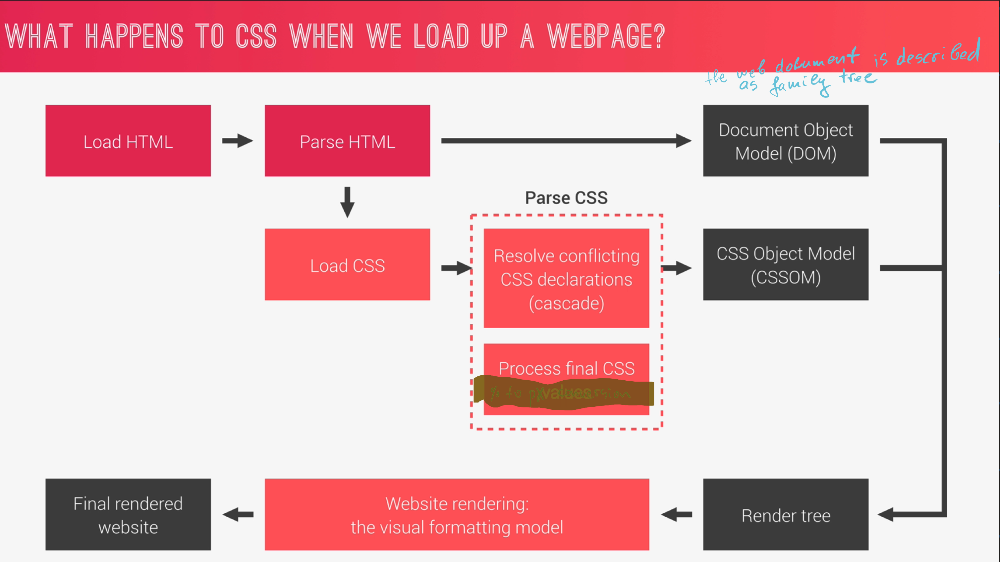

# Css Terminology

## Selector & Declaration block & declaration & property & declared value 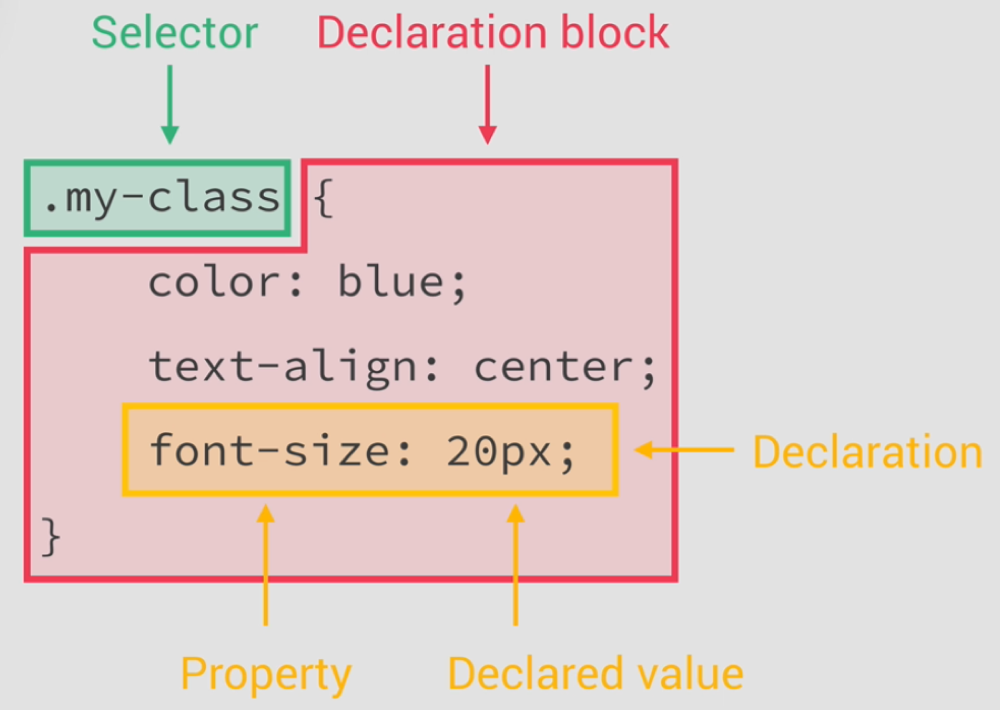

 

## CSS sources

- Author declarations - the developer css

- User declarations - Ex: user settings about the font size

- Browser declarations (user agent css)

The css sources are applied from bottom to top from the above list

## Cascade

process of combining different stylesheets and resolving conflicts between different css rules and declarations, when more than one rule applies to a certain element.

In the cascade resolution phase "importance(weight)", "specificity" and "source order" are considered.

Different importance based on where the declaration came from (author, user, browser).

### Importance order:

1. User !important declarations
2. Author @important declarations
3. Author declarations
4. User declarations
5. Default browser declarations

### Specificity order:

1. Inline styles
2. IDs
3. Classes, pseudo-classes, attribute
4. Elements, pseudo-elements 

## How to calculate specificity?

(0, 0, 0, 0)

(inline, IDs, classes, elements)

 

For every item add +1. Example:

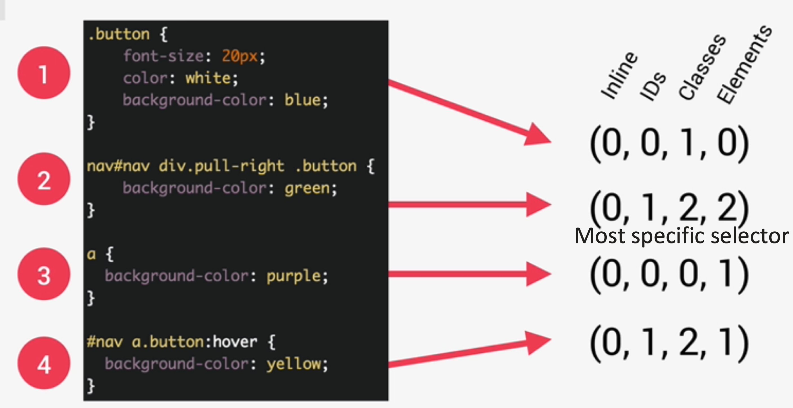

Note: the universal selector has no specificity value (0,0,0,0) 

#### Important

- rely more on specificity than     on the order of selectors
- A selector that contains 1 ID     is more specific than one with 1000 classes
- A selector that contains 1     class is more specific than one with 1000 elements

### How CSS values are processed?

1. Gather     declared values (author declarations)
2. Cascaded value (after the     cascade)
3. Specified value (defaulting     if there is no cascaded value)
4. Computed value (converting     relative values to absolute) - Ex: "color names",     "auto" are computed. Percentage is not a computed value
5. Used value (final     calculations based on layout)
6. Actual value (browser and     device restrictions) - Ex: 184.3px is something too specific that the     device cant visualize

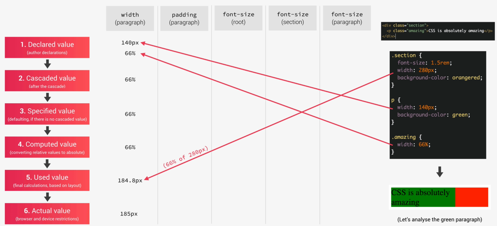 

 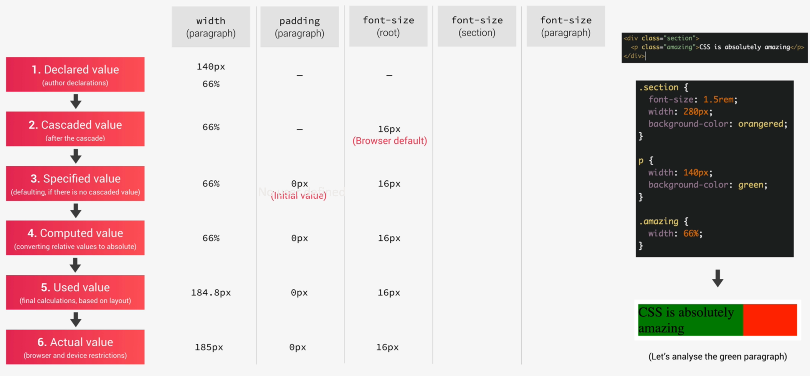

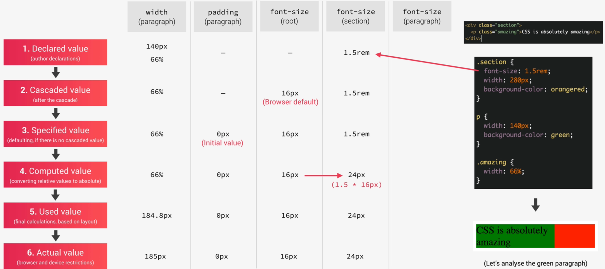

 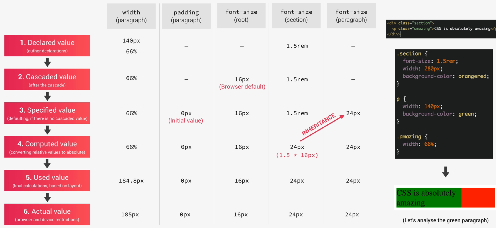

### Difference between em,rem,vh and vw

- "em" uses this or the parent element font size.

- "rem" uses the root font size

- "vh" is 1% of the view port height

- "vw" is 1% of the view port width

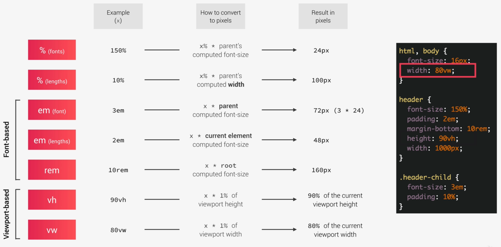

#### Notes:

- Each property has initial     value, used if nothing is declared(and if there is no inheritance)
- Browsers specify a root     font-size for each page (usually 16px)
- Percentages and relative     values are always converted to pixels
- Percentages are measured     relative to their parent's font-size, if used to specify font-size
- Percentages are measured     relative to their parent's width, if used to specify lengths
- "em" are measured     relative to their parent font-size, if used to specify font-size
- "em" are measured     relative to the current font-size, if used to specify lengths
- "rem" are always     measured relative to the document's root font-size
- "vh" and     "vw"
-  are simply percentage measurements of the     viewport's height and width

### CSS Inheritance

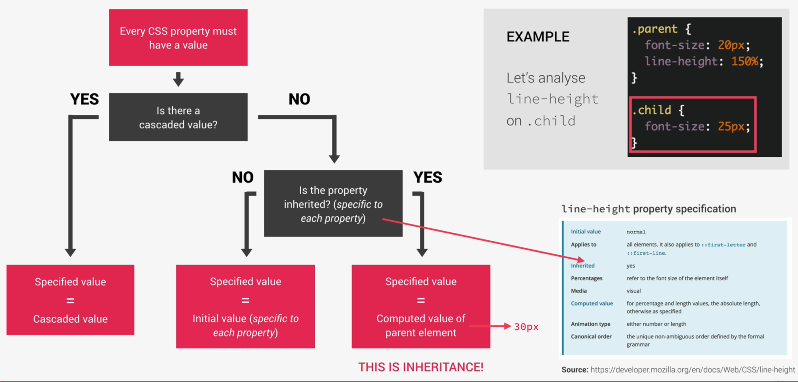

#### Notes:

- Only the computed values are     inherited and not the declared ones. Ex if you have 150% on the root     element you will not inherit 150% in the children but the computed value     (lets say 30px)

### The visual formatting model

Algorithm that calculates boxes and determines the layout of these boxes, for each element in the render tree, in order to determine the final layout of the page

To compute the visual formatting model these are taken into account:

- Dimensions of boxes:     calculated using the box model
- Box type: inline, block and     inline block
- Positioning scheme: floats     and positioning
- Stacking contexts
- Other elements in the render     tree
- Viewport size, dimensions of     images

 

### The box model

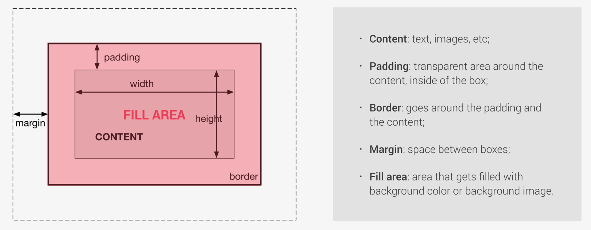

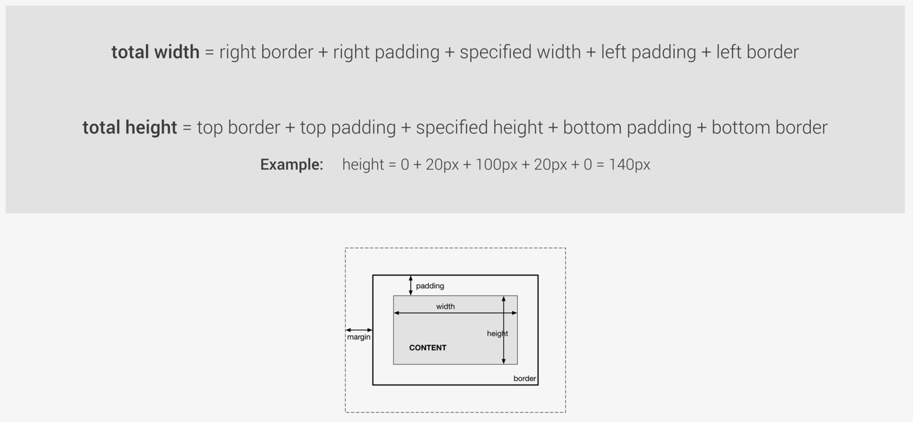

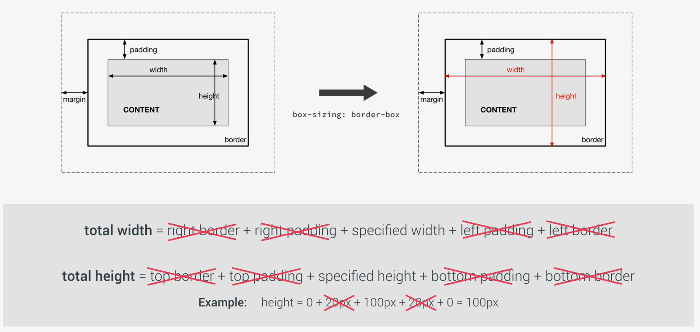

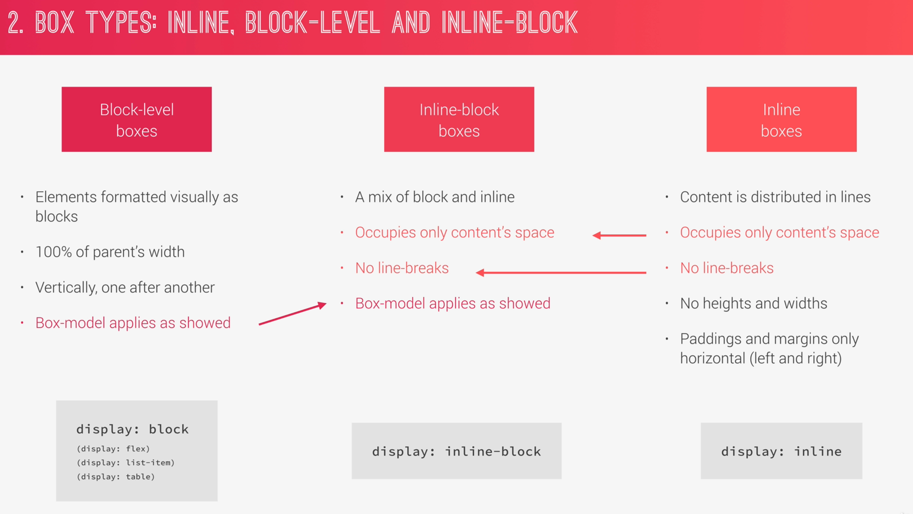

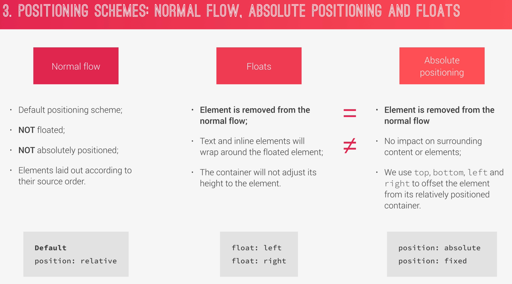

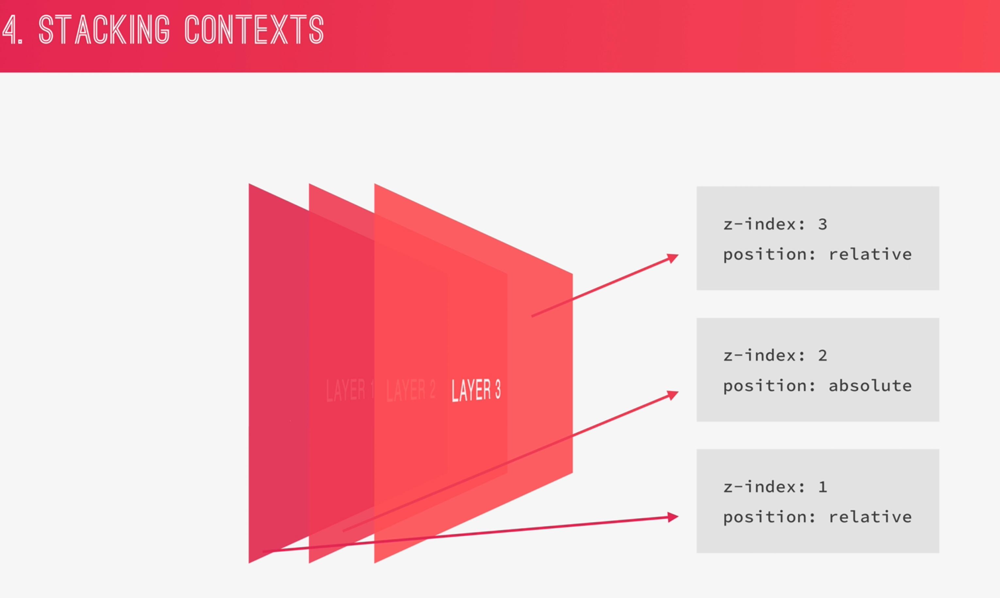

## Flexbox

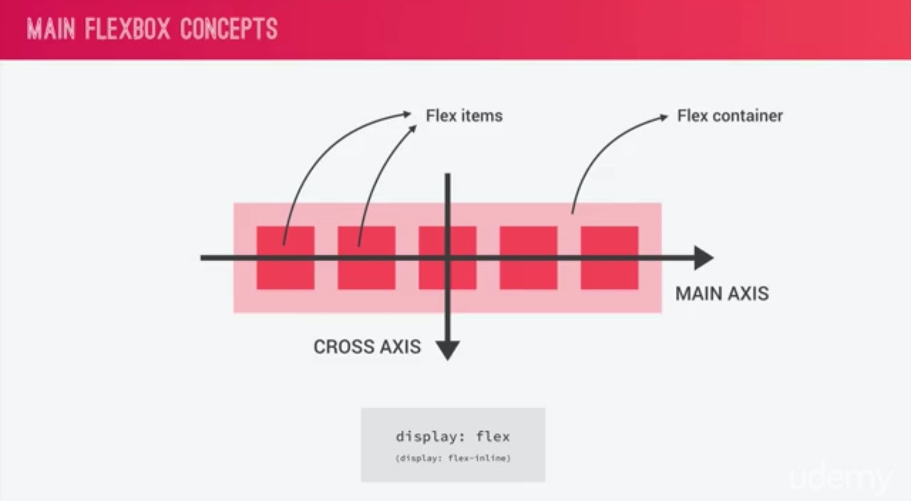

- flex-direction - in which direction the main axis go

- flex-wrap - if The items should wrap if there is no space on the line

- justify- content - how will the items be aligned on the main axis

- align-items - Similar to justify - content but alignment along the cross axis

- align-content - when there is more than 1 row. Controls how the rows are aligned in the cross axis

- align-self - if we want all items to have given align (center) but only 1 item to have other alignment, we can set to the container the align-items and set to the individual item the align-self

### Order

- Flex-grow - how much an item can grow

- Flex-shrink - how much an item can shrink

- Flex-basis - define its base width

 "flex: 0 1 auto;" is equal to "flex-grow: 0; flex-shrink:1; flex-basis: auto;"

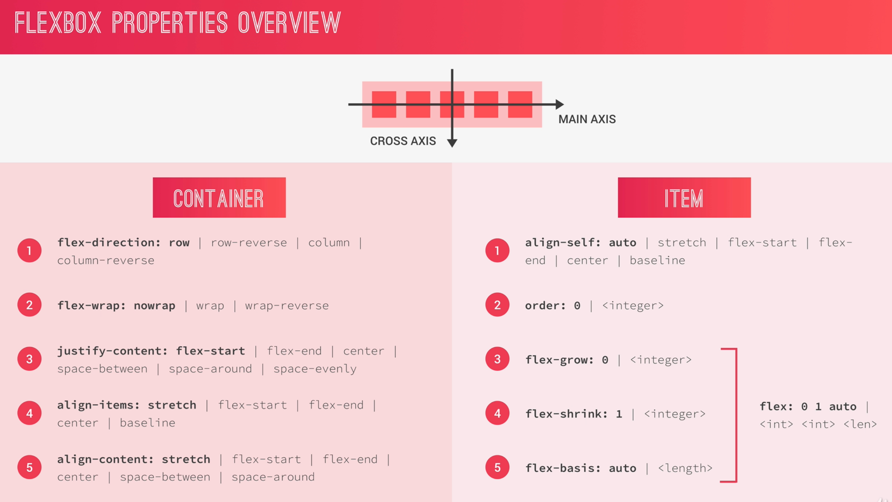 

# Responsive design 

## Rule #1: Use rems

- Links

- - https://www.udemy.com/advanced-css-and-sass/learn/lecture/8274436#overview

- Its easier to calculate if     you assume that the browser font size of the html element is 10px. By     default usually its 16px

- - html { font-size: 10px }

- To avoid hardcoded pixels and     also to respect the user settings about font-size do it with %. 62.5% from     16px is 10px

- - html { font-size: 62.5% }

