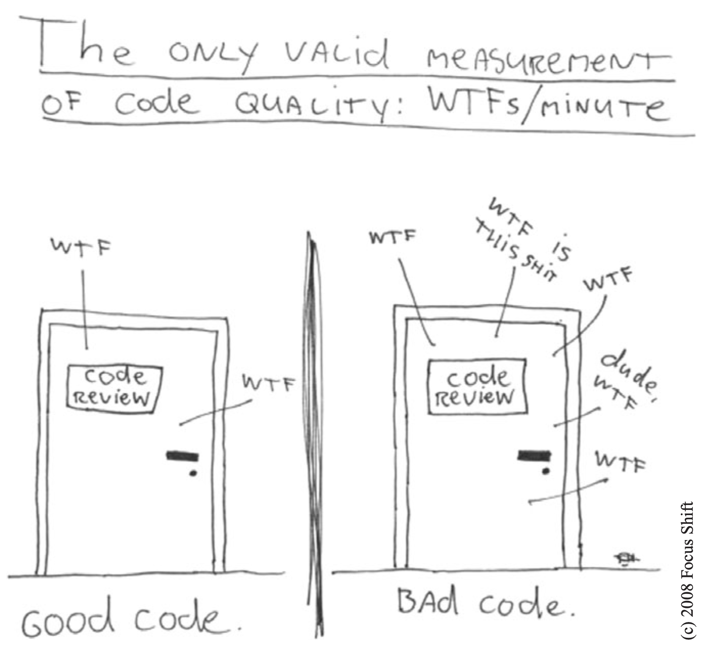

# Source

[[Book] Clean Code: A Handbook of Agile Software Craftsmanship - Robert C. Martin](https://www.amazon.com/Clean-Code-Handbook-Software-Craftsmanship/dp/0132350882)

# Foreword

Attentiveness to detail is an even more critical foundation of professionalism than is any grand vision. First, it is through practice in the small that professionals gain proficiency and trust for practice in the large. Second, the smallest bit of sloppy construction, of the door that does not close tightly or the slightly crooked tile on the floor, or even the messy desk, completely dispels the charm of the larger whole. That is what clean code is about.

In these days of Scrum and Agile, the focus is on quickly bringing *product* to market. We want the factory running at top speed to produce software. These are human factories: thinking, feeling coders who are working from a product back- log or user story to create *product*. The manufacturing metaphor looms ever strong in such thinking. The production aspects of Japanese auto manufacturing, of an assembly-line world, inspire much of Scrum.

Yet even in the auto industry, the bulk of the work lies not in manufacturing but in maintenance—or its avoidance. In software, 80% or more of what we do is quaintly called “maintenance”: the act of repair. Rather than embracing the typical Western focus on *pro- ducing* good software, we should be thinking more like home repairmen in the building industry, or auto mechanics in the automotive field. What does Japanese management have to say about *that*?

In about 1951, a quality approach called Total Productive Maintenance (TPM) came on the Japanese scene. Its focus is on maintenance rather than on production. One of the major pillars of TPM is the set of so-called 5S principles. These 5S principles are in fact at the founda- tions of Lean. These principles are not an option. As Uncle Bob relates in his front matter, good software practice requires such discipline: focus, presence of mind, and thinking. It is not always just about doing, about pushing the factory equipment to pro- duce at the optimal velocity. The 5S philosophy comprises these concepts:

- *Seiri*, or organization (think “sort” in English). Knowing where things are—using approaches such as suitable naming—is crucial. You think naming identifiers isn’t important? Read on in the following chapters.
- *Seiton*, or tidiness (think “systematize” in English). There is an old American saying: *A place for everything, and everything in its place*. A piece of code should be where you expect to find it—and, if not, you should re-factor to get it there.
- *Seiso*, or cleaning (think “shine” in English): Keep the workplace free of hanging wires, grease, scraps, and waste. What do the authors here say about littering your code with comments and commented-out code lines that capture history or wishes for the future? Get rid of them.
- *Seiketsu*, or standardization: The group agrees about how to keep the workplace clean. Do you think this book says anything about having a consistent coding style and set of practices within the group? Where do those standards come from? Read on.
- *Shutsuke*, or discipline (*self*-discipline). This means having the discipline to follow the practices and to frequently reflect on one’s work and be willing to change.

As we maintain automobiles and other machines under TPM, break- down maintenance—waiting for bugs to surface—is the exception. Instead, we go up a level: inspect the machines every day and fix wearing parts before they break, or do the equivalent of the proverbial 10,000-mile oil change to forestall wear and tear. In code, refactor mercilessly. You can improve yet one level further, as the TPM movement inno- vated over 50 years ago: build machines that are more maintainable in the first place. Mak- ing your code readable is as important as making it executable. The ultimate practice, introduced in TPM circles around 1960, is to focus on introducing entire new machines or replacing old ones. As Fred Brooks admonishes us, we should probably re-do major soft- ware chunks from scratch every seven years or so to sweep away creeping cruft. Perhaps we should update Brooks’ time constant to an order of weeks, days or hours instead of years. That’s where detail lies.

Unfortunately, we usually don’t view such concerns as key cornerstones of the art of programming. We abandon our code early, not because it is done, but because our value system focuses more on outward appearance than on the substance of what we deliver. This inattentiveness costs us in the end: *A bad penny always shows up*.

Back in my days working in the Bell Labs Software Production Research organization (*Production*, indeed!) we had some back-of-the-envelope findings that suggested that consistent indentation style was one of the most statistically significant indicators of low bug density.

The Japanese worldview understands the crucial value of the everyday worker and, more so, of the systems of development that owe to the simple, everyday actions of those workers. Quality is the result of a million selfless acts of care—not just of any great method that descends from the heavens. That these acts are simple doesn’t mean that they are simplistic, and it hardly means that they are easy. They are nonetheless the fabric of greatness and, more so, of beauty, in any human endeavor. To ignore them is not yet to be fully human.

It (the book message) fits with the current saw of the really code-based people like Peter Sommerlad, Kevlin Henney and Giovanni Asproni. “The code is the design” and “Simple code” are their mantras.

While we must take care to remember that the interface is the program, and that its structures have much to say about our program structure, it is crucial to continuously adopt the humble stance that the design lives in the code. And while rework in the manufacturing metaphor leads to cost, rework in design leads to value.

It’s in the code that the architectural metrics of coupling and cohesion play out. If you listen to Larry Constan- tine describe coupling and cohesion, he speaks in terms of code—not lofty abstract con- cepts that one might find in UML. Richard Gabriel advises us in his essay, “Abstraction Descant” that abstraction is evil. Code is anti-evil, and clean code is perhaps divine.

Going back to my little box of Ga-Jol, I think it’s important to note that the Danish wisdom advises us not just to pay attention to small things, but also to be *honest* in small things. This means being honest to the code, honest to our colleagues about the state of our code and, most of all, being honest with ourselves about our code. Did we Do our Best to “leave the campground cleaner than we found it”? Did we re-factor our code before check- ing in? These are not peripheral concerns but concerns that lie squarely in the center of Agile values. It is a recommended practice in Scrum that re-factoring be part of the con- cept of “Done.” Neither architecture nor clean code insist on perfection, only on honesty and doing the best we can. *To err is human; to forgive, divine.* In Scrum, we make every- thing visible. We air our dirty laundry. We are honest about the state of our code because code is never perfect.

# Introduction



Which door represents your code? Which door represents your team or your company? Why are we in that room? Is this just a normal code review or have we found a stream of horrible problems shortly after going live? Are we debugging in a panic, poring over code that we thought worked? Are customers leaving in droves and managers breathing downour necks? How can we make sure we wind up behind the *right* door when the going gets tough? The answer is: *craftsmanship*.

I can teach you the physics of riding a bicycle. Indeed, the classical mathematics is relatively straightforward. Gravity, friction, angular momentum, center of mass, and so forth, can be demonstrated with less than a page full of equations. Given those formulae I could prove to you that bicycle riding is practical and give you all the knowledge you needed to make it work. And you’d still fall down the first time you climbed on that bike.

Learning to write clean code is *hard work*. It requires more than just the knowledge of principles and patterns. You must *sweat* over it. You must practice it yourself, and watch yourself fail. You must watch others practice it and fail. You must see them stumble and retrace their steps. You must see them agonize over decisions and see the price they pay for making those decisions the wrong way.

# Clean code

## There will be code

One might argue that a book about code is somehow behind the times—that code is no longer the issue; that we should be concerned about models and requirements instead. Indeed some have suggested that we are close to the end of code. That soon all code will be generated instead of written. That programmers simply won’t be needed because busi- ness people will generate programs from specifications.

Nonsense! We will never be rid of code, because code represents the details of the requirements. At some level those details cannot be ignored or abstracted; they have to be specified. And specifying requirements in such detail that a machine can execute them *is programming*. Such a specification *is code*.

I expect that the level of abstraction of our languages will continue to increase. I also expect that the number of domain-specific languages will continue to grow. This will be a good thing. But it will not eliminate code. Indeed, all the specifications written in these higher level and domain-specific language will *be* code! It will still need to be rigorous, accurate, and so formal and detailed that a machine can understand and execute it.

## Bad code

I know of one company that, in the late 80s, wrote a *killer* app. It was very popular, and lots of professionals bought and used it. But then the release cycles began to stretch. Bugs were not repaired from one release to the next. Load times grew and crashes increased. I remember the day I shut the product down in frustration and never used it again. The company went out of business a short time after that.

Two decades later I met one of the early employees of that company and asked him what had happened. The answer confirmed my fears. They had rushed the product to market and had made a huge mess in the code. As they added more and more features, the code got worse and worse until they simply could not manage it any longer. *It was the bad code that brought the company down.*

Of course you have been impeded by bad code. So then—why did you write it?

Were you trying to go fast? Were you in a rush? Probably so. Perhaps you felt that you didn’t have time to do a good job; that your boss would be angry with you if you took the time to clean up your code. Perhaps you were just tired of working on this program and wanted it to be over. Or maybe you looked at the backlog of other stuff that you had prom- ised to get done and realized that you needed to slam this module together so you could move on to the next. We’ve all done it.

We’ve all said we’d go back and clean it up later. Of course, in those days we didn’t know LeBlanc’s law: *Later equals never*.

## The Total Cost of Owning a Mess

If you have been a programmer for more than two or three years, you have probably been significantly slowed down by someone else’s messy code. If you have been a programmer for longer than two or three years, you have probably been slowed down by messy code. The degree of the slowdown can be significant. Over the span of a year or two, teams that were moving very fast at the beginning of a project can find themselves moving at a snail’s pace. Every change they make to the code breaks two or three other parts of the code. No change is trivial. Every addition or modification to the system requires that the tangles, twists, and knots be “understood” so that more tangles, twists, and knots can be added. Over time the mess becomes so big and so deep and so tall, they can not clean it up. There is no way at all.

As the mess builds, the productivity of the team continues to decrease, asymptotically approaching zero. As productivity decreases, management does the only thing they can; they add more staff to the project in hopes of increasing productivity. But that new staff is not versed in the design of the system. They don’t know the difference between a change that matches the design intent and a change that thwarts the design intent. Furthermore, they, and everyone else on the team, are under horrific pressure to increase productivity. So they all make more and more messes, driving the productivity ever further toward zero.

### The Grand Redesign in the Sky

Eventually the team rebels. They inform management that they cannot continue to develop in this odious code base. They demand a redesign. Management does not want to expend the resources on a whole new redesign of the project, but they cannot deny that productiv- ity is terrible. Eventually they bend to the demands of the developers and authorize the grand redesign in the sky.

A new tiger team is selected. Everyone wants to be on this team because it’s a green- field project. They get to start over and create something truly beautiful. But only the best and brightest are chosen for the tiger team. Everyone else must continue to maintain the current system.

Now the two teams are in a race. The tiger team must build a new system that does everything that the old system does. Not only that, they have to keep up with the changes that are continuously being made to the old system. Management will not replace the old system until the new system can do everything that the old system does.

This race can go on for a very long time. I’ve seen it take 10 years. And by the time it’s done, the original members of the tiger team are long gone, and the current members are demanding that the new system be redesigned because it’s such a mess.

If you have experienced even one small part of the story I just told, then you already know that spending time keeping your code clean is not just cost effective; it’s a matter of professional survival.

### The Primal Conundrum

Programmers face a conundrum of basic values. All developers with more than a few years experience know that previous messes slow them down. And yet all developers feel the pressure to make messes in order to meet deadlines. In short, they don’t take the time to go fast!

True professionals know that the second part of the conundrum is wrong. You will *not* make the deadline by making the mess. Indeed, the mess will slow you down instantly, and will force you to miss the deadline. The *only* way to make the deadline—the only way to go fast—is to keep the code as clean as possible at all times.

> I like my code to be elegant and efficient. The logic should be straightforward to make it hard for bugs to hide, the dependencies minimal to ease maintenance, error handling complete according to an articulated strategy, and performance close to optimal so as not to tempt people to make the code messy with unprincipled optimizations. Clean code does one thing well.
>
> Bjarne Stroustrup, inventor of C++ and author of The C++ Programming Language

He uses the word “tempt.” There is a deep truth here. Bad code *tempts* the mess to grow! When others change bad code, they tend to make it worse.

Pragmatic Dave Thomas and Andy Hunt said this a different way. They used the metaphor of broken windows. A building with broken windows looks like nobody cares about it. So other people stop caring. They allow more windows to become broken. Eventually they actively break them. They despoil the facade with graffiti and allow garbage to collect. One broken window starts the process toward decay.

Bjarne also mentions that error handing should be complete. This goes to the disci- pline of paying attention to details. Abbreviated error handling is just one way that pro- grammers gloss over details. Memory leaks are another, race conditions still another. Inconsistent naming yet another. The upshot is that clean code exhibits close attention to detail.

Bjarne closes with the assertion that clean code does one thing well. It is no accident that there are so many principles of software design that can be boiled down to this simple admonition. Writer after writer has tried to communicate this thought. Bad code tries to do too much, it has muddled intent and ambiguity of purpose. Clean code is *focused*. Each function, each class, each module exposes a single-minded attitude that remains entirely undistracted, and unpolluted, by the surrounding details.

> Clean code is simple and direct. Clean code reads like well-written prose. Clean code never obscures the designer’s intent but rather is full of crisp abstractions and straightforward lines of control.
>
> Grady Booch, author of Object Oriented Analysis and Design with Applications

Grady makes some of the same points as Bjarne, but he takes a *readability* perspective. I especially like his view that clean code should read like well-written prose. Think back on a really good book that you’ve read. Remember how the words disappeared to be replaced by images!

> Clean code can be read, and enhanced by a developer other than its original author. It has unit and acceptance tests. It has meaningful names. It provides one way rather than many ways for doing one thing. It has minimal dependencies, which are explicitly defined, and provides a clear and minimal API. Code should be literate since depending on the language, not all necessary information can be expressed clearly in code alone.
>
> “Big” Dave Thomas, founder of OTI, godfather of the Eclipse strategy

Big Dave shares Grady’s desire for readability, but with an important twist. Dave asserts that clean code makes it easy for *other* people to enhance it. This may seem obvious, but it can not be overemphasized. There is, after all, a difference between code that is easy to read and code that is easy to change.

Dave ties cleanliness to tests! Ten years ago this would have raised a lot of eyebrows. But the discipline of Test Driven Development has made a profound impact upon our industry and has become one of our most fundamental disciplines. Dave is right. Code, without tests, is not clean. No matter how elegant it is, no matter how readable and acces- sible, if it hath not tests, it be unclean.

Dave uses the word *minimal* twice. Apparently he values code that is small, rather than code that is large. Indeed, this has been a common refrain throughout software litera- ture since its inception. Smaller is better.

Dave also says that code should be *literate*.This is a soft reference to Knuth’s *literate* *programming.* The upshot is that the code should be composed in such a form as to make it readable by humans.

> *In recent years I begin, and nearly end, with Beck’s rules of simple code. In priority order, simple code:*
>
> - *Runs all the tests;*
> - *Contains no duplication;*
> - *Expresses all the design ideas that are in the system;*
> - *Minimizes the number of entities such as classes, methods, functions, and the like.*
>
> *Of these, I focus mostly on duplication. When the same thing is done over and over, it’s a sign that there is an idea in our mind that is not well represented in the code. I try to figure out what it is. Then I try to express that idea more clearly.*
>
> *Expressiveness to me includes meaningful names, and I am likely to change the names of things several times before I settle in. With modern coding tools such as Eclipse, renaming is quite inexpensive, so it doesn’t trouble me to change. Expressiveness goes **beyond names, however. I also look at whether an object or method is doing more than one thing. If it’s an object, it probably needs to be broken into two or more objects. If it’s a method, I will always use the Extract Method refactoring on it, resulting in one method that says more clearly what it does, and some submethods saying how it is done.*
>
> Ron Jeffries, author of Extreme Programming Installed and Extreme Programming Adventures in C#

## The Boy Scout Rule

It’s not enough to write the code well. The code has to be *kept clean* over time. We’ve all seen code rot and degrade as time passes. So we must take an active role in preventing this degradation.

The Boy Scouts of America have a simple rule that we can apply to our profession.

> Leave the campground cleaner than you found it

# Meaningful Names

## Use Intention-Revealing Names

It is easy to say that names should reveal intent. Choosing good names takes time but saves more than it takes.

The name of a variable, function, or class, should answer all the big questions. It should tell you why it exists, what it does, and how it is used. If a name requires a comment, then the name does not reveal its intent.

```c++
int d; // elapsed time in days
```

The name d reveals nothing. It does not evoke a sense of elapsed time, nor of days. We should choose a name that specifies what is being measured and the unit of that measurement:

```c++
int elapsedTimeInDays;
int daysSinceCreation;
int daysSinceModification;
int fileAgeInDays;
```

What is the purpose of this code?

```c++
public List<int[]> getThem() {
	List<int[]> list1 = new ArrayList<int[]>();
  for (int[] x : theList)
		if (x[0] == 4)
      list1.add(x);
	return list1;
}
```

Why is it hard to tell what this code is doing? There are no complex expressions. Spacing and indentation are reasonable. There are only three variables and two constants mentioned. There aren’t even any fancy classes or polymorphic methods, just a list of arrays (or so it seems).

The problem isn’t the simplicity of the code but the *implicity* of the code (to coin a phrase): the degree to which the context is not explicit in the code itself. The code implicitly requires that we know the answers to questions such as:

1. What kinds of things are in theList?
2. What is the significance of the zeroth subscript of an item in theList?
3. What is the significance of the value 4?
4. How would I use the list being returned?

The answers to these questions are not present in the code sample, *but they could have been*. Say that we’re working in a mine sweeper game. We find that the board is a list of cells called theList. Let’s rename that to gameBoard.

Each cell on the board is represented by a simple array. We further find that the zeroth subscript is the location of a status value and that a status value of 4 means “flagged.” Just by giving these concepts names we can improve the code considerably:

```java
public List<int[]> getFlaggedCells() {
	List<int[]> flaggedCells = new ArrayList<int[]>();
  for (int[] cell : gameBoard)
		if (cell[STATUS_VALUE] == FLAGGED)
      flaggedCells.add(cell);
	return flaggedCells;
}
```

Notice that the simplicity of the code has not changed. It still has exactly the same number of operators and constants, with exactly the same number of nesting levels. But the code has become much more explicit.

We can go further and write a simple class for cells instead of using an array of ints. It can include an intention-revealing function (call it isFlagged) to hide the magic num- bers. It results in a new version of the function:

```java
public List<Cell> getFlaggedCells() {
	List<Cell> flaggedCells = new ArrayList<Cell>();
	for (Cell cell : gameBoard)
		if (cell.isFlagged())
			flaggedCells.add(cell);
	return flaggedCells;
}
```

## Avoid Disinformation

Programmers must avoid leaving false clues that obscure the meaning of code. We should avoid words whose entrenched meanings vary from our intended meaning. For example, hp, aix, and sco would be poor variable names because they are the names of Unix plat- forms or variants. Even if you are coding a hypotenuse and hp looks like a good abbreviation, it could be disinformative.

Do not refer to a grouping of accounts as an accountList unless it’s actually a List. The word list means something specific to programmers. If the container holding the accounts is not actually a List, it may lead to false conclusions. So accountGroup or bunchOfAccounts or just plain accounts would be better.

Spelling similar concepts similarly is *information*. Using inconsistent spellings is *dis- information*. With modern Java environments we enjoy automatic code completion. We write a few characters of a name and press some hotkey combination (if that) and are rewarded with a list of possible completions for that name. It is very helpful if names for very similar things sort together alphabetically and if the differences are very obvious, because the developer is likely to pick an object by name without seeing your copious comments or even the list of methods supplied by that class.

## Make Meaningful Distinctions

Programmers create problems for themselves when they write code solely to satisfy a compiler or interpreter. For example, because you can’t use the same name to refer to two different things in the same scope, you might be tempted to change one name in an arbitrary way. Sometimes this is done by misspelling one, leading to the surprising situation where correcting spelling errors leads to an inability to compile.

Number-series naming (a1, a2, .. aN) is the opposite of intentional naming. Such names are not disinformative—they are noninformative; they provide no clue to the author’s intention. Consider:

```java
public static void copyChars(char a1[], char a2[]) {
	for (int i = 0; i < a1.length; i++) {
		a2[i] = a1[i];
	}
}
```

This function reads much better when source and destination are used for the argument names.

Noise words are another meaningless distinction. Imagine that you have a Product class. If you have another called ProductInfo or ProductData, you have made the names different without making them mean anything different. Info and Data are indistinct noise words like a, an, and the.

Noise words are redundant. The word variable should never appear in a variable name. The word table should never appear in a table name. How is NameString better than Name? Would a Name ever be a floating point number? If so, it breaks an earlier rule about disinformation. Imagine finding one class named Customer and another named CustomerObject. What should you understand as the distinction? Which one will represent the best path to a customer’s payment history?

## Use Pronounceable Names

Humans are good at words. A significant part of our brains is dedicated to the concept of words. And words are, by definition, pronounceable. It would be a shame not to take advantage of that huge portion of our brains that has evolved to deal with spoken language. So make your names pronounceable.

If you can’t pronounce it, you can’t discuss it without sounding like an idiot. “Well, over here on the bee cee arr three cee enn tee we have a pee ess zee kyew int, see?” This matters because programming is a social activity.

## Use Searchable Names

Single-letter names and numeric constants have a particular problem in that they are not easy to locate across a body of text.

One might easily grep for MAX_CLASSES_PER_STUDENT, but the number 7 could be more troublesome. Searches may turn up the digit as part of file names, other constant definitions, and in various expressions where the value is used with different intent. It is even worse when a constant is a long number and someone might have transposed digits, thereby creating a bug while simultaneously evading the programmer’s search.

My personal preference is that single-letter names can ONLY be used as local variables inside short methods. *The length of a name should correspond to the size of its scope* If a variable or constant might be seen or used in multiple places in a body of code, it is imperative to give it a search-friendly name.

```c#
for (int j=0; j<34; j++) {
	s += (t[j]*4)/5;
}
```

```c#
int realDaysPerIdealDay = 4;
const int WORK_DAYS_PER_WEEK = 5;
int sum = 0;
for (int j=0; j < NUMBER_OF_TASKS; j++) {
	int realTaskDays = taskEstimate[j] * realDaysPerIdealDay;
  int realTaskWeeks = (realdays / WORK_DAYS_PER_WEEK);
  sum += realTaskWeeks;
}
```

Note that sum, above, is not a particularly useful name but at least is searchable. The intentionally named code makes for a longer function, but consider how much easier it will be to find WORK_DAYS_PER_WEEK than to find all the places where 5 was used and filter the list down to just the instances with the intended meaning.

## Avoid Encodings

### Hungarian Notation

In days of old, when we worked in name-length-challenged languages, we violated this rule out of necessity, and with regret. Fortran forced encodings by making the first letter a code for the type. Early versions of BASIC allowed only a letter plus one digit. Hungarian Notation (HN) took this to a whole new level.

HN was considered to be pretty important back in the Windows C API, when everything was an integer handle or a long pointer or a void pointer, or one of several implementations of “string” (with different uses and attributes). The compiler did not check types in those days, so the programmers needed a crutch to help them remember the types.

In modern languages we have much richer type systems, and the compilers remember and enforce the types. What’s more, there is a trend toward smaller classes and shorter functions so that people can usually see the point of declaration of each variable they’re using.

```java
PhoneNumber phoneString;
// name not changed when type changed!
```

### Member Prefixes

You also don’t need to prefix member variables with m_ anymore. Your classes and functions should be small enough that you don’t need them. And you should be using an editing environment that highlights or colorizes members to make them distinct.

```c#
public class Part {
	private String m_dsc; // The textual description
	
	void setName(String name) {
		m_dsc = name;
	}
}
_________________________________________________
public class Part {
	String description;

	void setDescription(String description) {
		this.description = description;
  }
}

```

### Interfaces and Implementations

These are sometimes a special case for encodings. For example, say you are building an ABSTRACT FACTORY for the creation of shapes. This factory will be an interface and will be implemented by a concrete class. What should you name them? IShapeFactory and ShapeFactory? I prefer to leave interfaces unadorned. The preceding I, so common in today’s legacy wads, is a distraction at best and too much information at worst. I don’t want my users knowing that I’m handing them an interface. I just want them to know that it’s a ShapeFactory. So if I must encode either the interface or the implementation, I choose the implementation. Calling it ShapeFactoryImp, or even the hideous CShapeFactory, is preferable to encoding the interface.

## Avoid Mental Mapping

Readers shouldn’t have to mentally translate your names into other names they already know. This problem generally arises from a choice to use neither problem domain terms nor solution domain terms.

This is a problem with single-letter variable names. Certainly a loop counter may be named i or j or k (though never l!) if its scope is very small and no other names can conflict with it. This is because those single-letter names for loop counters are traditional. However, in most other contexts a single-letter name is a poor choice; it’s just a place holder that the reader must mentally map to the actual concept. There can be no worse reason for using the name c than because a and b were already taken.

## Class Names

Classes and objects should have noun or noun phrase names like Customer, WikiPage, Account, and AddressParser. Avoid words like Manager, Processor, Data, or Info in the name of a class. A class name should not be a verb.

## Method Names

Methods should have verb or verb phrase names like postPayment, deletePage, or save. Accessors, mutators, and predicates should be named for their value and prefixed with get, set, and is according to the javabean standard.

When constructors are overloaded, use static factory methods with names that describe the arguments. For example,

```java
Complex fulcrumPoint = Complex.FromRealNumber(23.0);
```

is generally better than

```java
Complex fulcrumPoint = new Complex(23.0);
```

Consider enforcing their use by making the corresponding constructors private.

## Don’t Be Cute

If names are too clever, they will be memorable only to people who share the author’s sense of humor, and only as long as these people remember the joke. Will they know what the function named HolyHandGrenade is supposed to do? Sure, it’s cute, but maybe in this case DeleteItems might be a better name. Choose clarity over entertainment value.

Cuteness in code often appears in the form of colloquialisms or slang. For example, don’t use the name whack() to mean kill(). Don’t tell little culture-dependent jokes like eatMyShorts() to mean abort().

## Pick One Word per Concept

Pick one word for one abstract concept and stick with it. For instance, it’s confusing to have fetch, retrieve, and get as equivalent methods of different classes. How do you remember which method name goes with which class? Sadly, you often have to remember which company, group, or individual wrote the library or class in order to remember which term was used. Otherwise, you spend an awful lot of time browsing through headers and previous code samples.

Likewise, it’s confusing to have a controller and a manager and a driver in the same code base. What is the essential difference between a DeviceManager and a Protocol- Controller? Why are both not controllers or both not managers? Are they both Drivers really? The name leads you to expect two objects that have very different type as well as having different classes.

A consistent lexicon is a great boon to the programmers who must use your code.

## Don’t Pun

Avoid using the same word for two purposes. Using the same term for two different ideas is essentially a pun.

## Add Meaningful Context

If you follow the “one word per concept” rule, you could end up with many classes that have, for example, an add method. As long as the parameter lists and return values of the various add methods are semantically equivalent, all is well.

However one might decide to use the word add for “consistency” when he or she is not in fact adding in the same sense. Let’s say we have many classes where add will create a new value by adding or concatenating two existing values. Now let’s say we are writing a new class that has a method that puts its single parameter into a collection. Should we call this method add? It might seem consistent because we have so many other add methods, but in this case, the semantics are different, so we should use a name like insert or append instead. To call the new method add would be a pun.

## Use Solution Domain Names

Remember that the people who read your code will be programmers. So go ahead and use computer science (CS) terms, algorithm names, pattern names, math terms, and so forth. It is not wise to draw every name from the problem domain because we don’t want our coworkers to have to run back and forth to the customer asking what every name means when they already know the concept by a different name.

The name AccountVisitor means a great deal to a programmer who is familiar with the VISITOR pattern. What programmer would not know what a JobQueue was? There are lots of very technical things that programmers have to do. Choosing technical names for those things is usually the most appropriate course.

## Use Problem Domain Names

When there is no “programmer-eese” for what you’re doing, use the name from the problem domain. At least the programmer who maintains your code can ask a domain expert what it means.

Separating solution and problem domain concepts is part of the job of a good programmer and designer. The code that has more to do with problem domain concepts should have names drawn from the problem domain.

## Add Meaningful Context

There are a few names which are meaningful in and of themselves—most are not. Instead, you need to place names in context for your reader by enclosing them in well-named classes, functions, or namespaces. When all else fails, then prefixing the name may be necessary as a last resort.

Imagine that you have variables named firstName, lastName, street, houseNumber, city, state, and zipcode. Taken together it’s pretty clear that they form an address. But what if you just saw the state variable being used alone in a method? Would you automatically infer that it was part of an address?

You can add context by using prefixes: addrFirstName, addrLastName, addrState, and so on. At least readers will understand that these variables are part of a larger structure. Of course, a better solution is to create a class named Address. Then, even the compiler knows that the variables belong to a bigger concept.

## Don’t Add Gratuitous Context

In an imaginary application called “Gas Station Deluxe,” it is a bad idea to prefix every class with GSD. Frankly, you are working against your tools. You type G and press the com- pletion key and are rewarded with a mile-long list of every class in the system. Is that wise? Why make it hard for the IDE to help you?

Likewise, say you invented a MailingAddress class in GSD’s accounting module, and you named it GSDAccountAddress. Later, you need a mailing address for your customer contact application. Do you use GSDAccountAddress? Does it sound like the right name? Ten of 17 characters are redundant or irrelevant.

Shorter names are generally better than longer ones, so long as they are clear. Add no more context to a name than is necessary.

The names accountAddress and customerAddress are fine names for instances of the class Address but could be poor names for classes. Address is a fine name for a class. If I need to differentiate between MAC addresses, port addresses, and Web addresses, I might consider PostalAddress, MAC, and URI. The resulting names are more precise, which is the point of all naming.

# Functions

In the early days of programming we composed our systems of routines and subroutines. Then, in the era of Fortran and PL/1 we composed our systems of programs, subprograms, and functions. Nowadays only the function survives from those early days. Functions are the first line of organization in any program.

## Small!

The first rule of functions is that they should be small. The second rule of functions is that *they should be smaller than that*. This is not an assertion that I can justify. I can’t provide any references to research that shows that very small functions are better. What I can tell you is that for nearly four decades I have written functions of all different sizes. I’ve written several nasty 3,000-line abominations. I’ve written scads of functions in the 100 to 300 line range. And I’ve written functions that were 20 to 30 lines long. What this experience has taught me, through long trial and error, is that functions should be very small.

In the eighties we used to say that a function should be no bigger than a screen-full. Of course we said that at a time when VT100 screens were 24 lines by 80 columns, and our editors used 4 lines for administrative purposes. Nowadays with a cranked-down font and a nice big monitor, you can fit 150 characters on a line and a 100 lines or more on a screen. Lines should not be 150 characters long. Functions should not be 100 lines long. Functions should hardly ever be 20 lines long.

How short should a function be? In 1999 I went to visit Kent Beck at his home in Oregon. We sat down and did some programming together. At one point he showed me a cute little Java/Swing program that he called *Sparkle*. It produced a visual effect on the screen very similar to the magic wand of the fairy godmother in the movie Cinderella. As you moved the mouse, the sparkles would drip from the cursor with a satisfying scintillation, falling to the bottom of the window through a simulated gravitational field. When Kent showed me the code, I was struck by how small all the functions were. I was used to functions in Swing programs that took up miles of vertical space. Every function in *this* program was just two, or three, or four lines long. Each was transparently obvious. Each told a story. And each led you to the next in a compelling order. *That’s* how short your functions should be!

### Blocks and Indenting

This implies that the blocks within if statements, else statements, while statements, and so on should be one line long. Probably that line should be a function call. Not only does this keep the enclosing function small, but it also adds documentary value because the function called within the block can have a nicely descriptive name.

This also implies that functions should not be large enough to hold nested structures. Therefore, the indent level of a function should not be greater than one or two. This, of course, makes the functions easier to read and understand.

## Do One Thing

The following advice has appeared in one form or another for 30 years or more.

> FUNCTIONS SHOULD DO ONE THING. THEY SHOULD DO IT WELL. THEY SHOULD DO IT ONLY.

We can describe the function by describing it as a brief *TO*(The LOGO language used the keyword “TO” in the same way that Ruby and Python use “def.” So every function began with the word “TO.” This had an interesting effect on the way functions were designed.) paragraph:

> *TO RenderPageWithSetupsAndTeardowns, we check to see whether the page is a test page and if so, we include the setups and teardowns. In either case we render the page in HTML.*

If a function does only those steps that are one level below the stated name of the function, then the function is doing one thing. After all, the reason we write functions is to decompose a larger concept (in other words, the name of the function) into a set of steps at the next level of abstraction.

So, another way to know that a function is doing more than “one thing” is if you can extract another function from it with a name that is not merely a restatement of its implementation

### Sections within Functions

Look at Listing 4-7(some code example) on page 71. Notice that the generatePrimes function is divided into sections such as *declarations*, *initializations*, and *sieve*. This is an obvious symptom of doing more than one thing. Functions that do one thing cannot be reasonably divided into sections.

## One Level of Abstraction per Function

In order to make sure our functions are doing “one thing,” we need to make sure that the statements within our function are all at the same level of abstraction. It is easy to see how Listing 3-1 violates this rule. There are concepts in there that are at a very high level of abstraction, such as getHtml(); others that are at an intermediate level of abstraction, such as: String pagePathName = PathParser.render(pagePath); and still others that are remark- ably low level, such as: .append("\n").

Mixing levels of abstraction within a function is always confusing. Readers may not be able to tell whether a particular expression is an essential concept or a detail. Worse, like broken windows, once details are mixed with essential concepts, more and more details tend to accrete within the function.

### Reading Code from Top to Bottom: The Stepdown Rule

We want the code to read like a top-down narrative. We want every function to be followed by those at the next level of abstraction so that we can read the program, descending one level of abstraction at a time as we read down the list of functions. I call this *The Step- down Rule*.

To say this differently, we want to be able to read the program as though it were a set of *TO* paragraphs, each of which is describing the current level of abstraction and referencing subsequent *TO* paragraphs at the next level down.

> *To include the setups and teardowns, we include setups, then we include the test page content, and then we include the teardowns.*
>
> *To include the setups, we include the suite setup if this is a suite, then we include the regular setup.*
>
> *To include the suite setup, we search the parent hierarchy for the “SuiteSetUp” page and add an include statement with the path of that page.*
>
> *To search the parent. . .*

It turns out to be very difficult for programmers to learn to follow this rule and write functions that stay at a single level of abstraction. But learning this trick is also very important. It is the key to keeping functions short and making sure they do “one thing.” Making the code read like a top-down set of *TO* paragraphs is an effective technique for keeping the abstraction level consistent.

## Switch Statements

It’s hard to make a small switch statement. Even a switch statement with only two cases is larger than I’d like a single block or function to be. It’s also hard to make a switch statement that does one thing. By their nature, switch statements always do *N* things. Unfortunately we can’t always avoid switch statements, but we *can* make sure that each switch statement is buried in a low-level class and is never repeated. We do this, of course, with polymorphism.

Consider Listing 3-4. It shows just one of the operations that might depend on the type of employee.

```java
public Money calculatePay(Employee e) throws InvalidEmployeeType {
  switch (e.type) {
    case COMMISSIONED:
  		return calculateCommissionedPay(e);
    case HOURLY:
  		return calculateHourlyPay(e);
    case SALARIED:
  		return calculateSalariedPay(e);
    default:
  		throw new InvalidEmployeeType(e.type);
  }
}
```

There are several problems with this function. First, it’s large, and when new employee types are added, it will grow. Second, it very clearly does more than one thing. Third, it violates the Single Responsibility Principle7 (SRP) because there is more than one reason for it to change. Fourth, it violates the Open Closed Principle8 (OCP) because it must change whenever new types are added. But possibly the worst problem with this function is that there are an unlimited number of other functions that will have the same structure. For example we could have

```java
isPayday(Employee e, Date date)
```

or

```java
deliverPay(Employee e, Money pay)
```

or a host of others. All of which would have the same deleterious structure.

The solution to this problem (see Listing 3-5) is to bury the switch statement in the basement of an ABSTRACT FACTORY, and never let anyone see it. The factory will use the switch statement to create appropriate instances of the derivatives of Employee, and the various functions, such as calculatePay, isPayday, and deliverPay, will be dispatched polymorphically through the Employee interface.

```java
# Listing 3-5
# Employee and Factory

public abstract class Employee {
  public abstract boolean isPayday();
  public abstract Money calculatePay();
  public abstract void deliverPay(Money pay);
}
-----------------
public interface EmployeeFactory {
	public Employee makeEmployee(EmployeeRecord r) throws InvalidEmployeeType;
}
-----------------
public class EmployeeFactoryImpl implements EmployeeFactory {
	public Employee makeEmployee(EmployeeRecord r) throws InvalidEmployeeType {
		switch (r.type) {
      case COMMISSIONED:
				return new CommissionedEmployee(r);
      case HOURLY:
				return new HourlyEmployee(r);
      case SALARIED:
				return new SalariedEmploye(r);
      default:
				throw new InvalidEmployeeType(r.type);
    }
	}
}
```

## Use Descriptive Names

Remember Ward’s principle: “*You know you are working on clean code when each routine turns out to be pretty much what you expected.*” Half the battle to achieving that principle is choosing good names for small functions that do one thing. The smaller and more focused a function is, the easier it is to choose a descriptive name.

Don’t be afraid to make a name long. A long descriptive name is better than a short enigmatic name. A long descriptive name is better than a long descriptive comment. Use a naming convention that allows multiple words to be easily read in the function names, and then make use of those multiple words to give the function a name that says what it does.

Don’t be afraid to spend time choosing a name. Indeed, you should try several different names and read the code with each in place. Modern IDEs like Eclipse or IntelliJ make it trivial to change names. Use one of those IDEs and experiment with different names until you find one that is as descriptive as you can make it.

Choosing descriptive names will clarify the design of the module in your mind and help you to improve it. It is not at all uncommon that hunting for a good name results in a favorable restructuring of the code.

Be consistent in your names. Use the same phrases, nouns, and verbs in the function names you choose for your modules.

## Function Arguments

The ideal number of arguments for a function is zero (niladic). Next comes one (monadic), followed closely by two (dyadic). Three arguments (triadic) should be avoided where possible. More than three (polyadic) requires very special justification—and then shouldn’t be used anyway.

Arguments are hard. They take a lot of conceptual power. That’s why I got rid of almost all of them from the example. Consider, for instance, the StringBuffer in the example. We could have passed it around as an argument rather than making it an instance variable, but then our readers would have had to interpret it each time they saw it. When you are reading the story told by the module, includeSetupPage() is easier to understand than includeSetupPageInto(newPageContent). The argument is at a different level of abstraction than the function name and forces you to know a detail (in other words, StringBuffer) that isn’t particularly important at that point.

Arguments are even harder from a testing point of view. Imagine the difficulty of writing all the test cases to ensure that all the various combinations of arguments work properly. If there are no arguments, this is trivial. If there’s one argument, it’s not too hard. With two arguments the problem gets a bit more challenging. With more than two argu- ments, testing every combination of appropriate values can be daunting.

Output arguments are harder to understand than input arguments. When we read a function, we are used to the idea of information going *in* to the function through arguments and *out* through the return value. We don’t usually expect information to be going out through the arguments. So output arguments often cause us to do a double-take.

One input argument is the next best thing to no arguments. SetupTeardown- Includer.render(pageData) is pretty easy to understand. Clearly we are going to *render* the data in the pageData object.

### Common Monadic Forms

There are two very common reasons to pass a single argument into a function. You may be asking a question about that argument, as in boolean fileExists(“MyFile”). Or you may be operating on that argument, transforming it into something else and *returning it*. For example, InputStream fileOpen(“MyFile”) transforms a file name String into an InputStream return value. These two uses are what readers expect when they see a function.

A somewhat less common, but still very useful form for a single argument function, is an *event*. In this form there is an input argument but no output argument. The overall program is meant to interpret the function call as an event and use the argument to alter the state of the system, for example, void passwordAttemptFailedNtimes(int attempts). Use this form with care. It should be very clear to the reader that this is an event. Choose names and contexts carefully.

Try to avoid any monadic functions that don’t follow these forms, for example, void includeSetupPageInto(StringBuffer pageText). Using an output argument instead of a return value for a transformation is confusing. If a function is going to transform its input argument, the transformation should appear as the return value. Indeed, StringBuffer transform(StringBuffer in) is better than void transform-(StringBuffer out), even if the implementation in the first case simply returns the input argument. At least it still follows the form of a transformation.

### Flag Arguments

Flag arguments are ugly. Passing a boolean into a function is a truly terrible practice. It immediately complicates the signature of the method, loudly proclaiming that this function does more than one thing. It does one thing if the flag is true and another if the flag is false!

The method call render(true) is just plain confusing to a poor reader. Mousing over the call and seeing render(boolean isSuite) helps a little, but not that much. We should have split the function into two: renderForSuite() and renderForSingleTest().

### Dyadic Functions

A function with two arguments is harder to understand than a monadic function. For example `writeField(name)` is easier to understand than `writeField(output-Stream, name)`. Though the meaning of both is clear, the first glides past the eye, easily depositing its meaning. The second requires a short pause until we learn to ignore the first parameter. And *that*, of course, eventually results in problems because we should never ignore any part of code. The parts we ignore are where the bugs will hide. 

There are times, of course, where two arguments are appropriate. For example, `Point p = new Point(0,0);` is perfectly reasonable. Cartesian points naturally take two arguments. Indeed, we’d be very surprised to see `new Point(0)`. However, the two argu- ments in this case *are ordered components of a single value!* Whereas output-Stream and name have neither a natural cohesion, nor a natural ordering.

Even obvious dyadic functions like `assertEquals(expected, actual)` are problematic. How many times have you put the actual where the expected should be? The two arguments have no natural ordering. The expected,actual ordering is a convention that requires practice to learn.

You should be aware that dyads come at a cost and should take advantage of what mechanims may be available to you to convert them into monads. For example, you might make the writeField method a member of outputStream so that you can say outputStream. writeField(name). Or you might make the outputStream a member variable of the current class so that you don’t have to pass it. Or you might extract a new class like FieldWriter that takes the outputStream in its constructor and has a write method.

### Triads

Functions that take three arguments are significantly harder to understand than dyads. The issues of ordering, pausing, and ignoring are more than doubled.

For example, consider the common overload of assertEquals that takes three arguments: assertEquals(message, expected, actual). How many times have you read the message and thought it was the expected? I have stumbled and paused over that particular triad many times. In fact, *every time I see it,* I do a double-take and then learn to ignore the message.

Here is a triad that is not quite so insidious: assertEquals(1.0, amount, .001). Although this still requires a double-take, it’s one that’s worth taking. It’s always good to be reminded that equality of floating point values is a relative thing.

### Argument Objects

When a function seems to need more than two or three arguments, it is likely that some of those arguments ought to be wrapped into a class of their own. Consider, for example, the difference between the two following declarations:

```java
Circle makeCircle(double x, double y, double radius);
Circle makeCircle(Point center, double radius);
```

Reducing the number of arguments by creating objects out of them may seem like cheating, but it’s not. When groups of variables are passed together, the way x and y are in the example above, they are likely part of a concept that deserves a name of its own.

### Argument Lists

Sometimes we want to pass a variable number of arguments into a function. Consider, for example, the String.format method:

```java
String.format("%s worked %.2f hours.", name, hours);
```

If the variable arguments are all treated identically, as they are in the example above, then they are equivalent to a single argument of type List. By that reasoning, String.format is actually dyadic. Indeed, the declaration of String.format as shown below is clearly dyadic.

```java
public String format(String format, Object... args)
```

So all the same rules apply. Functions that take variable arguments can be monads, dyads, or even triads. But it would be a mistake to give them more arguments than that.

```java
void monad(Integer... args);
void dyad(String name, Integer... args);
void triad(String name, int count, Integer... args);
```

### Verbs and Keywords

Choosing good names for a function can go a long way toward explaining the intent of the function and the order and intent of the arguments. In the case of a monad, the function and argument should form a very nice verb/noun pair. For example, write(name) is very evocative. Whatever this “name” thing is, it is being “written.” An even better name might be writeField(name), which tells us that the “name” thing is a “field.”

This last is an example of the *keyword* form of a function name. Using this form we encode the names of the arguments into the function name. For example, assertEquals might be better written as assertExpectedEqualsActual(expected, actual). This strongly mitigates the problem of having to remember the ordering of the arguments.

## Have No Side Effects

Side effects are lies. Your function promises to do one thing, but it also does other *hidden* things. Sometimes it will make unexpected changes to the variables of its own class. Sometimes it will make them to the parameters passed into the function or to system globals. In either case they are devious and damaging mistruths that often result in strange temporal couplings and order dependencies.

If you a method called `checkPassword()` also initializes an user session can be considered having a side effect. A caller who believes what the name of the function says runs the risk of erasing the existing session data when he or she decides to check the validity of the user.

This side effect creates a temporal coupling. That is, checkPassword can only be called at certain times (in other words, when it is safe to initialize the session). If it is called out of order, session data may be inadvertently lost. Temporal couplings are confusing, especially when hidden as a side effect. If you must have a temporal coupling, you should make it clear in the name of the function. In this case we might rename the function checkPasswordAndInitializeSession, though that certainly violates “Do one thing.”

### Output Arguments

Arguments are most naturally interpreted as *inputs* to a function. If you have been programming for more than a few years, I’m sure you’ve done a double-take on an argument that was actually an *output* rather than an input.

For example:

```java
appendFooter(s);
```

Does this function append s as the footer to something? Or does it append some footer to s? Is s an input or an output? It doesn’t take long to look at the function signature and see:

```java
public void appendFooter(StringBuffer report)
```

This clarifies the issue, but only at the expense of checking the declaration of the function. Anything that forces you to check the function signature is equivalent to a double-take. It’s a cognitive break and should be avoided.

In the days before object oriented programming it was sometimes necessary to have output arguments. However, much of the need for output arguments disappears in OO languages because this is *intended* to act as an output argument. In other words, it would be better for appendFooter to be invoked as

```java
report.appendFooter();
```

In general output arguments should be avoided. If your function must change the state of something, have it change the state of its owning object.

## Command Query Separation

Functions should either do something or answer something, but not both. Either your function should change the state of an object, or it should return some information about that object. Doing both often leads to confusion.

Consider, for example, the following function:

```java
public boolean set(String attribute, String value);
```

This function sets the value of a named attribute and returns true if it is successful and false if no such attribute exists. This leads to odd statements like this:

```java
if (set("username", "unclebob")) {}
```

The author intended set to be a verb, but in the context of the if statement it *feels* like an adjective. So the statement reads as “If the username attribute was previously set to unclebob” and not “set the username attribute to unclebob and if that worked then. . . .” We could try to resolve this by renaming the set function to setAndCheckIfExists, but that doesn’t much help the readability of the if statement. The real solution is to separate the command from the query so that the ambiguity cannot occur.

```java
if (attributeExists("username")) {
	setAttribute("username", "unclebob");
}
```

## Prefer Exceptions to Returning Error Codes

Returning error codes from command functions is a subtle violation of command query separation. It promotes commands being used as expressions in the predicates of if statements.

```java
if (deletePage(page) == E_OK)
```

This does not suffer from verb/adjective confusion but does lead to deeply nested structures. When you return an error code, you create the problem that the caller must deal with the error immediately.

```java
if (deletePage(page) == E_OK) {
  if (registry.deleteReference(page.name) == E_OK) {
	  if (configKeys.deleteKey(page.name.makeKey()) == E_OK){
      logger.log("page deleted");
	  } else {
  		logger.log("configKey not deleted");
	  }
  } else {
  	logger.log("deleteReference from registry failed");
  }
} else {
	logger.log("delete failed");
	return E_ERROR;
}
```

On the other hand, if you use exceptions instead of returned error codes, then the error processing code can be separated from the happy path code and can be simplified:

```java
try {
  deletePage(page);
  registry.deleteReference(page.name);
  configKeys.deleteKey(page.name.makeKey());
} catch (Exception e) {
	logger.log(e.getMessage());
}
```

### Extract Try/Catch Blocks

Try/catch blocks are ugly in their own right. They confuse the structure of the code and mix error processing with normal processing. So it is better to extract the bodies of the try and catch blocks out into functions of their own.

```java
public void delete(Page page) {
	try {
		deletePageAndAllReferences(page);
  } catch (Exception e) {
    logError(e);
  }
}

private void deletePageAndAllReferences(Page page) throws Exception {
  deletePage(page);
  registry.deleteReference(page.name);
  configKeys.deleteKey(page.name.makeKey());
}

private void logError(Exception e) {
  logger.log(e.getMessage());
}
```

In the above, the delete function is all about error processing. It is easy to understand and then ignore. The deletePageAndAllReferences function is all about the processes of fully deleting a page. Error handling can be ignored. This provides a nice separation that makes the code easier to understand and modify.

### Error Handling Is One Thing

Functions should do one thing. Error handing is one thing. Thus, a function that handles errors should do nothing else. This implies (as in the example above) that if the keyword try exists in a function, it should be the very first word in the function and that there should be nothing after the catch/finally blocks.

### The Error.java Dependency Magnet

Returning error codes usually implies that there is some class or enum in which all the error codes are defined.

```java
public enum Error {
  OK,
  INVALID,
  NO_SUCH,
  LOCKED,
  OUT_OF_RESOURCES,
  WAITING_FOR_EVENT
}
```

Classes like this are a *dependency magnet;* many other classes must import and use them. Thus, when the Error enum changes, all those other classes need to be recompiled and redeployed. This puts a negative pressure on the Error class. Programmers don’t want to add new errors because then they have to rebuild and redeploy everything. So they reuse old error codes instead of adding new ones.

When you use exceptions rather than error codes, then new exceptions are *derivatives* of the exception class. They can be added without forcing any recompilation or redeployment.

## Don’t Repeat Yourself

Duplication is a problem because it bloats the code and will require four-fold modification should the algorithm ever have to change. It is also a four-fold opportunity for an error of omission.

Duplication may be the root of all evil in software. Many principles and practices have been created for the purpose of controlling or eliminating it. Consider, for example, that all of Codd’s database normal forms serve to eliminate duplication in data. Consider also how object-oriented programming serves to concentrate code into base classes that would otherwise be redundant. Structured programming, Aspect Oriented Programming, Component Oriented Programming, are all, in part, strategies for eliminating duplication. It would appear that since the invention of the subroutine, innovations in software development have been an ongoing attempt to eliminate duplication from our source code.

## Structured Programming

Some programmers follow Edsger Dijkstra’s rules of structured programming. Dijkstra said that every function, and every block within a function, should have one entry and one exit. Following these rules means that there should only be one return statement in a function, no break or continue statements in a loop, and never, *ever,* any goto statements.

While we are sympathetic to the goals and disciplines of structured programming, those rules serve little benefit when functions are very small. It is only in larger functions that such rules provide significant benefit.

So if you keep your functions small, then the occasional multiple return, break, or continue statement does no harm and can sometimes even be more expressive than the single-entry, single-exit rule. On the other hand, goto only makes sense in large functions, so it should be avoided.

## Conclusion

Every system is built from a domain-specific language designed by the programmers to describe that system. Functions are the verbs of that language, and classes are the nouns. This is not some throwback to the hideous old notion that the nouns and verbs in a requirements document are the first guess of the classes and functions of a system. Rather, this is a much older truth. The art of programming is, and has always been, the art of language design.

Master programmers think of systems as stories to be told rather than programs to be written. They use the facilities of their chosen programming language to construct a much richer and more expressive language that can be used to tell that story. Part of that domain-specific language is the hierarchy of functions that describe all the actions that take place within that system. In an artful act of recursion those actions are written to use the very domain-specific language they define to tell their own small part of the story.

# Comments

Comments are, at best, a necessary evil. If our programming languages were expressive enough, or if we had the talent to subtly wield those languages to express our intent, we would not need comments very much—perhaps not at all.

The proper use of comments is to compensate for our failure to express ourself in code. Note that I used the word *failure*. I meant it. Comments are always failures. We must have them because we cannot always figure out how to express ourselves without them, but their use is not a cause for celebration.

Why am I so down on comments? Because they lie. Not always, and not intentionally, but too often. The older a comment is, and the farther away it is from the code it describes, the more likely it is to be just plain wrong. The reason is simple. Programmers can’t realis-tically maintain them.

It is possible to make the point that programmers should be disciplined enough to keep the comments in a high state of repair, relevance, and accuracy. I agree, they should. But I would rather that energy go toward making the code so clear and expressive that it does not need the comments in the first place.

Truth can only be found in one place: the code. Only the code can truly tell you what it does.

## Comments Do Not Make Up for Bad Code

One of the more common motivations for writing comments is bad code. We write a module and we know it is confusing and disorganized. We know it’s a mess. So we say to our-selves, “Ooh, I’d better comment that!” No! You’d better clean it!

Clear and expressive code with few comments is far superior to cluttered and complex code with lots of comments. Rather than spend your time writing the comments that explain the mess you’ve made, spend it cleaning that mess.

## Explain Yourself in Code

Unfortunately, many programmers have taken this to mean that code is seldom, if ever, a good means for explanation. This is patently false.

Which would you rather see? This:

```java
// Check to see if the employee is eligible for full benefits
if ((employee.flags & HOURLY_FLAG) && (employee.age > 65)) {}
```

Or this?

```java
if (employee.isEligibleForFullBenefits()) {}
```

It takes only a few seconds of thought to explain most of your intent in code. In many cases it’s simply a matter of creating a function that says the same thing as the comment you want to write.

## Good comments

### Legal Comments

Sometimes our corporate coding standards force us to write certain comments for legal reasons. For example, copyright and authorship statements are necessary and reasonable things to put into a comment at the start of each source file.

Comments like this should not be contracts or legal tomes. Where possible, refer to a standard license or other external document rather than putting all the terms and conditions into the comment.

### Informative Comments

It is sometimes useful to provide basic information with a comment. For example, consider this comment that explains the return value of an abstract method:

```java
// Returns an instance of the Responder being tested.
protected abstract Responder responderInstance();
```

A comment like this can sometimes be useful, but it is better to use the name of the function to convey the information where possible. For example, in this case the comment could be made redundant by renaming the function: responderBeingTested.

```java
// format matched kk:mm:ss EEE, MMM dd, yyyy
Pattern timeMatcher = Pattern.compile("\\d*:\\d*:\\d* \\w*, \\w* \\d*, \\d*");
```

In this case the comment lets us know that the regular expression is intended to match a time and date that were formatted with the SimpleDateFormat.format function using the specified format string. Still, it might have been better, and clearer, if this code had been moved to a special class that converted the formats of dates and times. Then the comment would likely have been superfluous.

### Explanation of Intent

Sometimes a comment goes beyond just useful information about the implementation and provides the intent behind a decision. In the following case we see an interesting decision documented by a comment. When comparing two objects, the author decided that he wanted to sort objects of his class higher than objects of any other.

```java
public int compareTo(Object o) {
	if(o instanceof WikiPagePath) {
		WikiPagePath p = (WikiPagePath) o;
    String compressedName = StringUtil.join(names, "");
    String compressedArgumentName = StringUtil.join(p.names, "");
    return compressedName.compareTo(compressedArgumentName);
	}
	return 1; // we are greater because we are the right type.
}

```

### Warning of Consequences

Sometimes it is useful to warn other programmers about certain consequences. For example, here is a comment that explains why a particular test case is turned off:

```java
// Don't run unless you
// have some time to kill.
public void _testWithReallyBigFile() {}
```

### TODO Comments

TODOs are jobs that the programmer thinks should be done, but for some reason can’t do at the moment. It might be a reminder to delete a deprecated feature or a plea for someone else to look at a problem. It might be a request for someone else to think of a better name or a reminder to make a change that is dependent on a planned event. Whatever else a TODO might be, it is *not* an excuse to leave bad code in the system.

### Amplification

A comment may be used to amplify the importance of something that may otherwise seem inconsequential.

```java
String listItemContent = match.group(3).trim();
// the trim is real important. It removes the starting
// spaces that could cause the item to be recognized
// as another list.
new ListItemWidget(this, listItemContent, this.level + 1);
return buildList(text.substring(match.end()));
```

### Javadocs in Public APIs

If you are writing a public API, then you should certainly write good javadocs for it. Javadocs can be just as misleading, nonlocal, and dishonest as any other kind of comment.

## Bad Comments

### Mumbling

Plopping in a comment just because you feel you should or because the process requires it, is a hack.

Here, for example, is a case I found in FitNesse, where a comment might indeed have been useful. But the author was in a hurry or just not paying much attention. His mumbling left behind an enigma:

```java
public void loadProperties() {
	try {
		String propertiesPath = propertiesLocation + "/" + PROPERTIES_FILE;
		FileInputStream propertiesStream = new FileInputStream(propertiesPath);
		loadedProperties.load(propertiesStream);
	} catch(IOException e) {
		// No properties files means all defaults are loaded
	}
}
```

What does that comment in the catch block mean? Clearly it meant something to the author, but the meaning does not come through all that well. Apparently, if we get an IOException, it means that there was no properties file; and in that case all the defaults are loaded. But who loads all the defaults? Were they loaded before the call to loadProperties.load? Or did loadProperties.load catch the exception, load the defaults, and then pass the exception on for us to ignore? Or did loadProperties.load load all the defaults before attempting to load the file? Was the author trying to comfort himself about the fact that he was leaving the catch block empty? Or—and this is the scary possibility— was the author trying to tell himself to come back here later and write the code that would load the defaults?

Our only recourse is to examine the code in other parts of the system to find out what’s going on. Any comment that forces you to look in another module for the meaning of that comment has failed to communicate to you and is not worth the bits it consumes.

### Redundant Comments

The comment probably takes longer to read than the code itself.

```java
// Utility method that returns when this.closed is true. Throws an exception
// if the timeout is reached.
public synchronized void waitForClose(final long timeoutMillis) throws Exception {
	if(!closed) {
		wait(timeoutMillis);
		if(!closed)
			throw new Exception("MockResponseSender could not be closed");
	}
}
```

It is rather like a gladhanding used-car salesman assuring you that you don’t need to look under the hood.

Now consider the legion of useless and redundant javadocs in Listing 4-2 taken from Tomcat. These comments serve only to clutter and obscure the code. They serve no documentary purpose at all. To make matters worse, I only showed you the first few. There are many more in this module.

```java
// Listing 4-2
// ContainerBase.java (Tomcat)

public abstract class ContainerBase implements Container, Lifecycle, Pipeline, MBeanRegistration, Serializable {
  /**
  * The processor delay for this component. */
  protected int backgroundProcessorDelay = -1;
  /**
  * The lifecycle event support for this component. */
  protected LifecycleSupport lifecycle = new LifecycleSupport(this);
  /**
  * The container event listeners for this Container. */
  protected ArrayList listeners = new ArrayList();
  /**
  * The Loader implementation with which this Container is * associated.
  */
  protected Loader loader = null;
  /**
  * The Logger implementation with which this Container is
  * associated.
  */
  protected Log logger = null;
  /**
  * Associated logger name. */
  protected String logName = null;
}
```

### Misleading Comments

A subtle bit of misinformation, couched in a comment that is harder to read than the body of the code, could cause another programmer to blithely call this function in the expectation that it will return as expected (For example doing stuff async but exposed through sync api). That poor programmer would then find himself in a debugging session trying to figure out why his code executed so slowly.

### Mandated Comments

It is just plain silly to have a rule that says that every function must have a javadoc, or every variable must have a comment. Comments like this just clutter up the code, propagate lies, and lend to general confusion and disorganization.

### Journal Comments

Sometimes people add a comment to the start of a module every time they edit it. These comments accumulate as a kind of journal, or log, of every change that has ever been made.

Long ago there was a good reason to create and maintain these log entries at the start of every module. We didn’t have source code control systems that did it for us. Nowadays, however, these long journals are just more clutter to obfuscate the module. They should be completely removed.`

### Noise Comments

Sometimes you see comments that are nothing but noise. They restate the obvious and provide no new information.

These comments are so noisy that we learn to ignore them. As we read through code, our eyes simply skip over them. Eventually the comments begin to lie as the code around them changes.

### Scary Noise

Javadocs can also be noisy. What purpose do the following Javadocs (from a well-known open-source library) serve? Answer: nothing. They are just redundant noisy comments written out of some misplaced desire to provide documentation.

```java
/** The name. */ private String name;
/** The version. */ private String version;
/** The licenceName. */ private String licenceName;
/** The version. */ private String info;
```

Read these comments again more carefully. Do you see the cut-paste error? If authors aren’t paying attention when comments are written (or pasted), why should readers be expected to profit from them?

### Don’t Use a Comment When You Can Use a Function or a Variable

Consider the following stretch of code:

```java
// does the module from the global list <mod> depend on the
// subsystem we are part of?
if (smodule.getDependSubsystems().contains(subSysMod.getSubSystem()))
```

This could be rephrased without the comment as

```java
ArrayList moduleDependees = smodule.getDependSubsystems();
String ourSubSystem = subSysMod.getSubSystem();
if (moduleDependees.contains(ourSubSystem))
```

The author of the original code may have written the comment first (unlikely) and then written the code to fulfill the comment. However, the author should then have refactored the code, as I did, so that the comment could be removed.

### Position Markers

Sometimes programmers like to mark a particular position in a source file.

For example, I recently found this in a program I was looking through:

```java
// Actions //////////////////////////////////
```

There are rare times when it makes sense to gather certain functions together beneath a banner like this. But in general they are clutter that should be eliminated—especially the noisy train of slashes at the end.

Think of it this way. A banner is startling and obvious if you don’t see banners very often. So use them very sparingly, and only when the benefit is significant. If you overuse banners, they’ll fall into the background noise and be ignored.

### Closing Brace Comments

Sometimes programmers will put special comments on closing braces, as in Listing 4-6. Although this might make sense for long functions with deeply nested structures, it serves only to clutter the kind of small and encapsulated functions that we prefer. So if you find yourself wanting to mark your closing braces, try to shorten your functions instead.

```java
// Listing 4-6

while (true) {
  try {
    
  } // try
  catch () {
    
  } // catch
} // while
```

### Attributions and Bylines

```java
/* Added by Rick */
```

Source code control systems are very good at remembering who added what, when. There is no need to pollute the code with little bylines. You might think that such comments would be useful in order to help others know who to talk to about the code. But the reality is that they tend to stay around for years and years, getting less and less accurate and relevant.

Again, the source code control system is a better place for this kind of information.

### Commented-Out Code

Few practices are as odious as commenting-out code. Don’t do this!

Others who see that commented-out code won’t have the courage to delete it. They’ll think it is there for a reason and is too important to delete. So commented-out code gathers like dregs at the bottom of a bad bottle of wine.

There was a time, back in the sixties, when commenting-out code might have been useful. But we’ve had good source code control systems for a very long time now. Those systems will remember the code for us. We don’t have to comment it out any more. Just delete the code. We won’t lose it. Promise.

### HTML Comments

HTML in source code comments is an abomination, as you can tell by reading the code below. It makes the comments hard to read in the one place where they should be easy to read—the editor/IDE. If comments are going to be extracted by some tool (like Javadoc) to appear in a Web page, then it should be the responsibility of that tool, and not the program- mer, to adorn the comments with appropriate HTML.

### Nonlocal Information

If you must write a comment, then make sure it describes the code it appears near. Don’t offer systemwide information in the context of a local comment.

Consider, for example, the javadoc comment below. Aside from the fact that it is horribly redundant, it also offers information about the default port. And yet the function has absolutely no control over what that default is. The comment is not describing the function, but some other, far distant part of the system. Of course there is no guarantee that this comment will be changed when the code containing the default is changed.

```java
/**
* Port on which fitnesse would run. Defaults to <b>8082</b>. *
* @param fitnessePort
*/
public void setFitnessePort(int fitnessePort) {
	this.fitnessePort = fitnessePort;
}
```

### Too Much Information

Don’t put interesting historical discussions or irrelevant descriptions of details into your comments. The comment below was extracted from a module designed to test that a function could encode and decode base64. Other than the RFC number, someone reading this code has no need for the arcane information contained in the comment.

```java
/*
RFC 2045 - Multipurpose Internet Mail Extensions (MIME)
Part One: Format of Internet Message Bodies
section 6.8. Base64 Content-Transfer-Encoding
The encoding process represents 24-bit groups of input bits as output strings of 4 encoded characters. Proceeding from left to right, a 24-bit input group is formed by concatenating 3 8-bit input groups. These 24 bits are then treated as 4 concatenated 6-bit groups, each of which is translated into a single digit in the base64 alphabet. When encoding a bit stream via the base64 encoding, the bit stream must be presumed to be ordered with the most-significant-bit first. That is, the first bit in the stream will be the high-order bit in the first 8-bit byte, and the eighth bit will be the low-order bit in the first 8-bit byte, and so on.
*/
```

### Inobvious Connection

The connection between a comment and the code it describes should be obvious. If you are going to the trouble to write a comment, then at least you’d like the reader to be able to look at the comment and the code and understand what the comment is talking about.

Consider, for example, this comment drawn from apache commons:

```java
/*
* start with an array that is big enough to hold all the pixels * (plus filter bytes), and an extra 200 bytes for header info */
this.pngBytes = new byte[((this.width + 1) * this.height * 3) + 200];
```

What is a filter byte? Does it relate to the +1? Or to the *3? Both? Is a pixel a byte? Why 200? The purpose of a comment is to explain code that does not explain itself. It is a pity when a comment needs its own explanation.

### Function Headers

Short functions don’t need much description. A well-chosen name for a small function that does one thing is usually better than a comment header.

### Javadocs in Nonpublic Code

As useful as javadocs are for public APIs, they are anathema to code that is not intended for public consumption. Generating javadoc pages for the classes and functions inside a system is not generally useful, and the extra formality of the javadoc comments amounts to little more than cruft and distraction.

