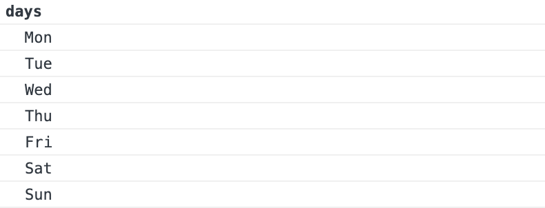
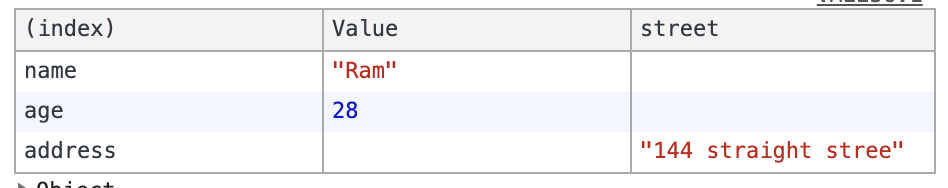

# Source

[[Article] Console cheat sheet for JavaScript developers](https://levelup.gitconnected.com/console-cheat-sheet-for-javascript-developers-21f0c49604d4)

# Console

## console.log(messages)

Outputs a message(variable) to the web console.

```javascript
console.log("hello");
// hello

var a =10;
console.log(a);
// 10

var b = 20;
console.log(a, b);
// 10, 20

// we can also evaluate expression 
console.log(a+b);
30console.log(`${a} + ${b} = ${a+b}`);
// 10 + 20 = 30

var obj = {name : "Javascript Jeep"};
console.log(a, b, obj)
// 10 20 {name: "Javascript Jeep"}
```

## console.clear()

This will remove all the console message and prints Console was cleared.

## console.assert(condition, failure message)

The console.assert method is an easy way to run simple assertion tests.

```javascript
var a = 10;
console.assert(a === 10, "This will not be printed");console.assert(a != 10, "this will be printed", `a = ${a}`);
// Assertion failed: this will be printed a = 10
```

## console.count()

Logs the number of times that this particular call to count() has been called.

```javascript
function test() {
  console.count();
}
test(); // default : 1 
test(); // default : 2
test(); // default : 3

// Example 2 :
// We can also use label to itfunction test(label) {
  console.count(label);
}
test("Times"); // Times: 1
test("Num"); // Num: 1test("Times"); // Times: 2
test("Num"); // Num: 2test("Times"); // Times: 3
test("Num"); // Num: 3
```

## console.countReset()

Resets the counter. This function takes an optional argument label.

```javascript
console.count(); // default: 1
console.count(); // default: 2
console.count(); // default: 3
console.countReset();
console.count(); // default: 1
console.count("time"); // time: 1
console.count("time"); // time: 2
console.count("time"); // time: 3
console.countReset();
console.count("time"); // time: 1
```

## console.info()

Prints a message to the console.

## console.warn()

Outputs a warning message to the console.

## console.error()

Outputs an error message to the console.

## console.trace()

Output the stack trace to the current function to the console.

```javascript
function a() {
   b();
}
function b() {
   c() 
}
function c() {
  console.trace()
}
function test() {
  a();
}
test()
```


## console.dir()

prints out objects in a nice formatted way

## console.dirxml()

It prints out a DOM element’s markup.

```javascript
console.dirxml(document.body);
// this will display body of the html element
```

## console.time(label) and console.timeEnd(label)

We can start a timer with `console.time` and then end it with `console.endTime`. By using this we can find the time taken to execute a function.

```javascript
function a () {
	for(let i = 0 ;i < 10000; i ++) {
       // operation;
  }
}
console.time();
a();
console.timeEnd();  // default: 0.18896484375msconsole.time("test");
a();
console.timeEnd("test"); // test: 0.35302734375ms
```

## Grouping console messages

```
console.group("days")
  console.log("Mon");
  console.log("Tue");
  console.log("Wed");
  console.log("Thu");
  console.log("Fri");
  console.log("Sat");
  console.log("Sun");
console.groupEnd("days")
```



# console.table(obj)

This prints the objects in table format

```javascript
var user = {
    name : "Ram",
    age : 28,
    address : {
      street : "144 straight stree"
    }
}
console.table(user);
```

