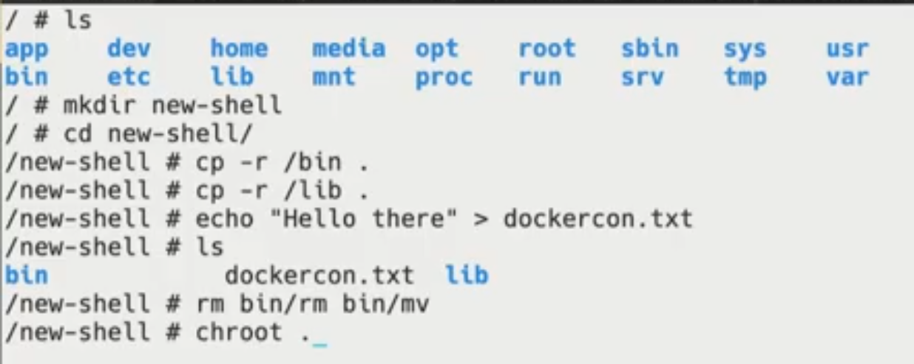

# Source

[Containers for Beginners](https://www.youtube.com/watch?v=6gJs0F8V3tM)

# Quick history of Shipping

If we think about history and shipping. A long time ago if I was a goods producer and I wanted to ship goods I just bundled them in whatever I had bags, barrels, crates whatever I had. I'd take my Goods down to the dock             they've loaded up on a ship and then the ship would carry it across the sea to the next market or wherever. Funny enough ships actually ended up being in dock more often and longer than they did while they were actually out to sea shipping their goods. It's because of such a process of taking goods on off the ship loading things in shoving them in every nook and cranny to maximize the space and the ship and then get it out to sea and then well taken everything off and now move things around and so the chance of loss and theft was really really high. And then the Industrial Revolution came along and now we've got rail that's moving things much faster across continents and countries. While it worked out really well we started to see the inefficiencies of moving things from one shipping method to another to another and so these inefficiencies started to really creep in. People started to notice them and so eventually if somebody said well why don't we just standardize around a box okay and let's with this box just throw whatever you want into it and as a shipping provider I can just standardize around this box I can know that it's gonna be a certain size it can carry a certain weight capacity so I can stack them so high and I as a shipping goods provider I don't have to worry about what's inside the box. And so if I'm a good producer I just again throw stuff in the Box hand it to the shipping company and it will end up where it needs to go and so this completely revolutionised shipping.


## Software = Shipping?

- Long time ago if I wanted to build an app I had to talk to my sis and say
  - "hey we've got a new app coming up"
- and they said
  - "great come back in six weeks we'll have a rack and stack for the new server set up and we will install all the stuff you need and then we'll give you access to it"

For a long time that was just accepted that was just the cost of business. So we would build at North schedules and we would have to deal with it. But now we're in a much different environment where it's how many hours have been since our last deploy. We're wanting to respond to user feedback as quickly as possible and adjust software and fix bugs whatever and get it out the door.

Now if we're still using old processes and just automating those processes we're still gaining a lot I'm sure but we still see a lot of the inefficiencies in the system and so that's where docker and containers really come in. Because now we're able to standardize around this box this container and by being standardized now we can build tools and everything on top of that abstraction.

# Chroot demo



Showed how chroot creates a new shell with the root folder you have passed into it (in this case the current "new-shell" folder)


The above failed because we have deleted the "rm" binary in the new root folder

In next steps he extracts inside "new-shell" folder an archive with nodejs binary and shows that it works by executing "node" command and writes some JS code.

Its a quick way to showcase that a docker image is just that.

# Creating images

- Best practice is to use `Dockerfile`
  - a text file that serves as a script to build an image
- Build using the `docker build` command

Example of a Dockerfile:

```dockerfile
FROM node
WORKDIR /app
COPY package.json yarn.lock .
RUN yarn install
COPY src ./src
CMD ["node", "src/index.js"]
```

# Sharing images

- once built, the image is only available locally 
- To share, push it to a docker registry using `docker push`
  - Docker Hub is the default registry
  - Docker EE includes the Docker Trusted Registry
  - Many other third party offerings available too
- Once shared others can pull the image

# Whats a container?

- While a container looks like a VM, it isnt
  - a container is just another process on the machine
- It uses namespaces and control groups (cgroups) to provide isolation
  - Namespaces include network, process, user, IPC, mount and others
- To run a container, use the `docker container run` command

Namespaces isolate the environment of the container.


The "container engine" doesnt sit between the app and the OS - it doesnt translate sys calls or anything. Once the container starts it is just a regular OS process.

With the VM (on left) you need to manage multiple binaries, OS patches and etc.

# Image Layering

- Images are composed of layers of filesystem changes
  - each layer can add or remove from the previous layer
  - each layer's filesystem changes are stored as a single tar file
- Each command in a Dockerfile creates a new layer
- Use the `docker image history` command to see the layers and the command that was used to create each layer


# Layer contents

- layers are unioned together to make a full filesystem
  - each layer can add files as needed
  - Files in "higher" layers replace the same file in "lower" layers
- The container uses the merged view


NOTE: be careful what you put in your Docker layers. Deleted files are not actually deleted but stay in the layers where they are created and just "hidden" in the "merged" view of the container

## Demo: revealing "deleted" files

`docker image history <image_name>` will show the history (commands used to build) of the image.

You can add `--no-trunc` to see the full commands

Uses `docker image save <image_name> | tar xf -` to get the content(layers) of the image. `docker image save` streams the archive so he pipes it to `tar`

# Best practices

## clean up as you go

- Dont wait until the end of the Docker file to clean up
- Chain RUN commands together to clean things as you go


## Keep images tight and focus

- Only install the deps/tools/packages that are neccessary
- Use multi-stage builds to separate build-time and run-time dependencies


# How to persist data?

Use Volumes

- Volumes provide the ability to persist/supply data
- Volume types
  - Bind mount volumes
    - You choose where to persist the data
    - Example: `-v $HOME/mysql-data:/var/lib/mysql`
  - Named volumes
    - Let Docker choose where to persist the data
    - Can use `docker volume inspect` to find actual location
    - Example: `-v mysql-data:/var/lib/mysql`

## Demo

runs `docker container run --rm -tiv ~/data:data ubuntu` to mount his ~/data to a "data" folder inside the container. Its a "bind" mount so changing files inside the "data" of the container they are stored in the host ~/data and synced.

# Docker compose

- Makes defining and running multi-container apps super easy
- Uses a YAML file for configuration (docker-compose.yml)
  - Often included in the project source repo at the root of the project
- With a single command, start all containers/services for an app
- Tool is bundled with Docker Desktop

# Docker networking

- Think of networking in terms of communication boundaries/isolation
  - if two containers are on the same network, they can tlk to each other
- Docker runs its own DNS resolver on each network
  - Allows it to resolve IP addresses of ther containers using "aliases"


# Container orchestration

- Orchestration provides the ability to managethe running of container workloads, often over a fleet of machines
- You define the expected state (desired state)
- The system tries to make the actual state reflect the expected state

## Various Orchestrators

- Docker swarm
- Kubernetes
- Amazon ECS