# Source

[Functional architecture - The pits of success - Mark Seemann](https://www.youtube.com/watch?v=US8QG9I1XW0)

# Ports and Adaptors (a.k.a hexagonal architecture, a.k.a onion architecture)

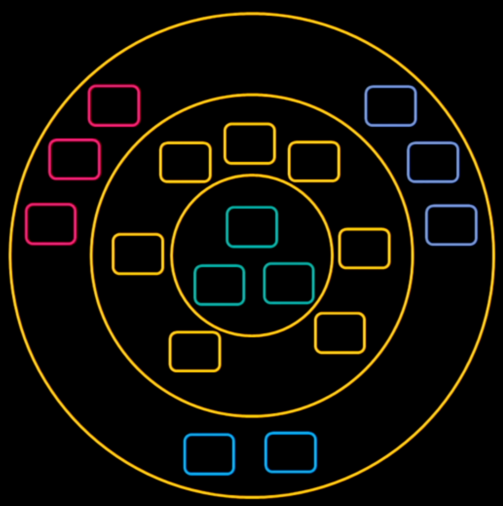

The greenish boxes in the center represent the domain model and domain/business logic. Other layers represent real world systems that the business logic interracts with (ex databases, sending emails and etc) but you dont want your business logic to be too dependant on those technical concerns because they might change.

# Pure functions

Benefits

- easy to reason about
- easy to manipulate
- easy to compose
- easy to test

Characteristics

- Deterministic - same return value for same input
- no side effects

Notes

- Pure function can call another pure function
- You can call impure function from another impure function - doesnt change that it is impure
- You can call pure function from impure function
- You SHOULDNT call impure function from pure function - it changes it to impure

# Reservation application logic example

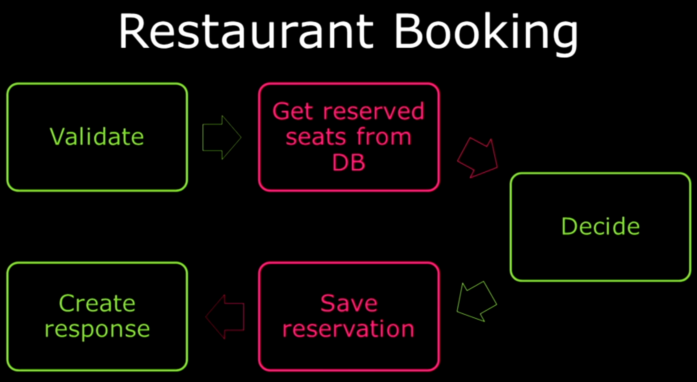

Note: Pure functions are in green. Impure are in red

## Pure function handling reservation validation in Haskel

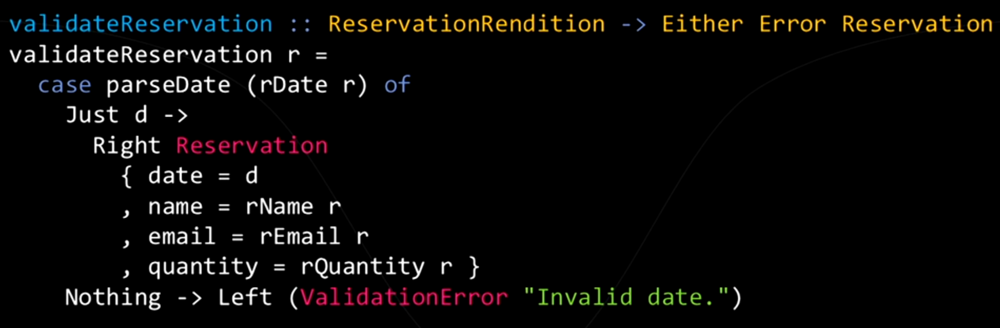

Note: in Haskel all functions are pure by default

## Get Reserved seats from DB

### Function signiture

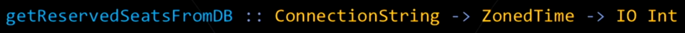

Note: has side effect (IO Int)

## Check capacity

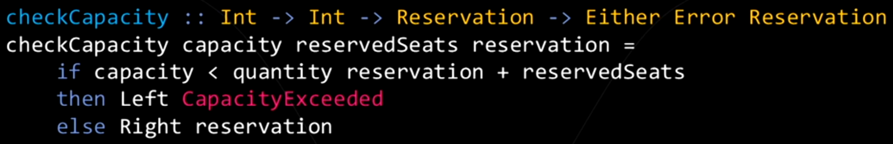

## Void save reservation

Note: has side effect (IO void)

### Diagram of code

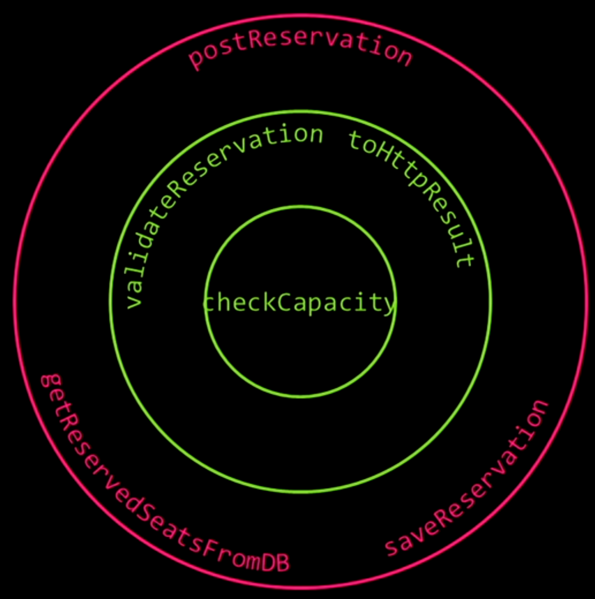

# Services and data

When people initially learn OOP they are often taught that objects are data with behaviour.

## Active record pattern example

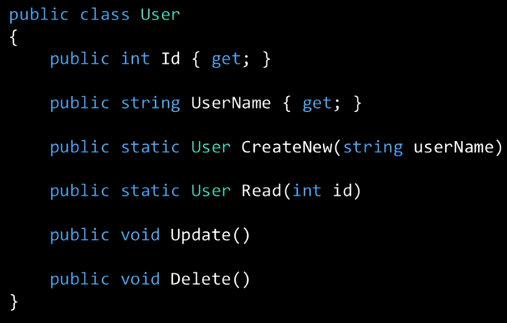

Note: probably can be considered an antipattern - Ex: Sending emails to users, storing them and etc shouldnt be part of the User class; It bloats the User class and creates a "God class" which is an known antipattern

## Domain driven design

### About the book by Eric Evans

You can treat your objects in 2 categories:

- Entities - objects that have long lasting identity (Ex: users)
- Value Objects

The business logic should be put into Services (obects that manage entities and value objects)

#### Refactored user

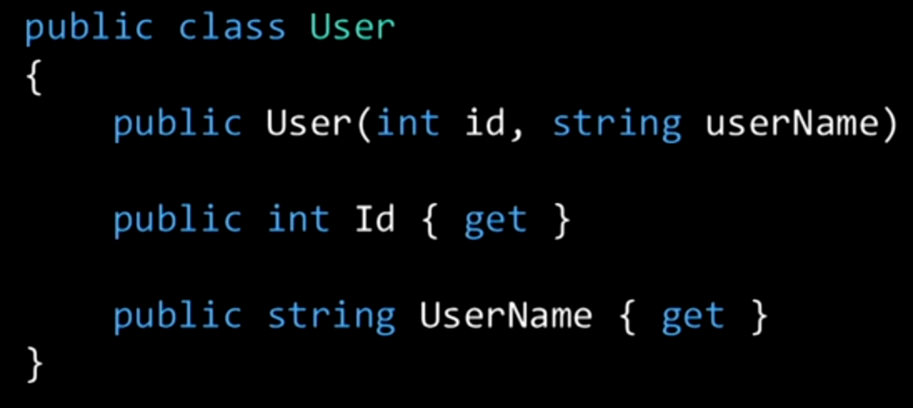

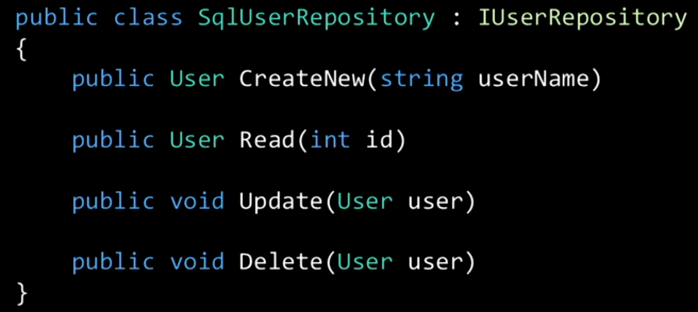

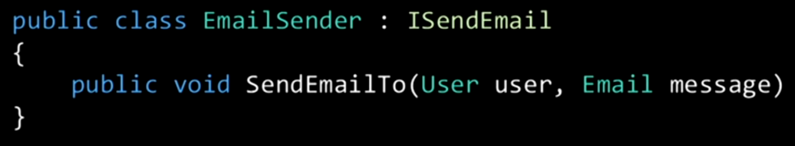

Note: there is an argument about having "anemic domain models" after your User object have been made simpler

## Functional programming architecture

It splits into "data" and "functions". Ex:

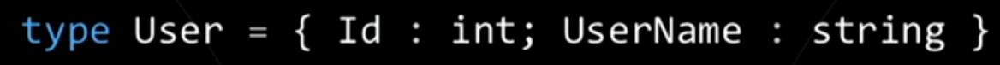

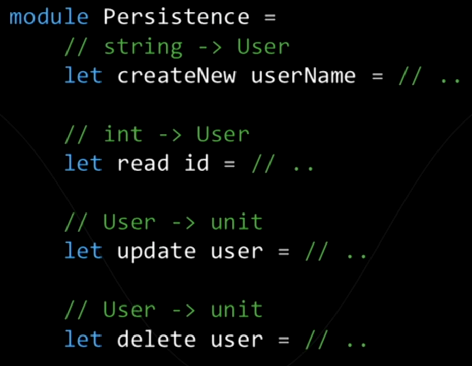

Note: the module in F# plays the role of a service in typical OOP. The above code in the module is impure

# Function isolation

When the only information a function has about the external world is passed into it via arguments. In short the function doesnt have any implicit knowledge about the external world.

A pure function is isolated.

# Unit testing

> A unit test is an automated test that tests a unit in isolation from its dependencies

