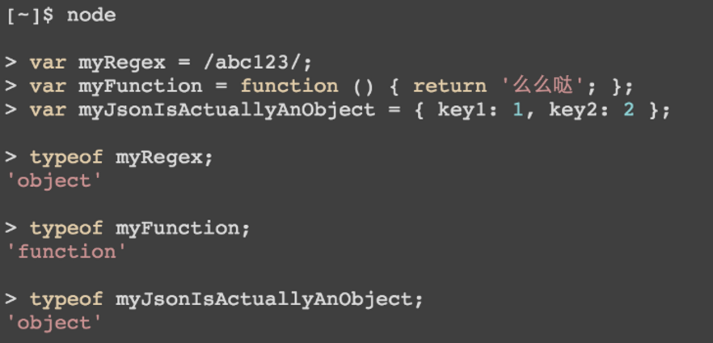

# Source

[Functional vs Procedural JavaScript](https://www.scalablepath.com/blog/javascript-functional-vs-procedural/)

I hate JavaScript. 

Well, at least I used to; because I misunderstood it. Before  JavaScript, I was mostly a .NET and PHP guy and approached JS the wrong  way. Here is why.

There are two major programming paradigms: *Procedural Programming*, which is based on concepts of procedure-call-like routines and subroutines and *Functional Programming*, which is based on expressions like variables, constants, functions, and operators. Some commonly used procedural languages today are PHP, Java, C/C++, Python, and C# while the more commonly known functional  programming languages are Haskell, Lisp, Clojure, R, and Erlang. Today,  most languages support both procedural and functional programming  (Scala, C# 2.5 +, Java 8 and Php 5.3+ for example) but JavaScript takes  the best of both worlds.

Procedural programming typically involves your code executing at the  top of your script and going in order, statement by statement, to the  bottom. Functional programming, however, centers more around the idea of the programming describing what should be done to an input and less  around the order in which that should occur.

To better understand these concepts, let’s build a function that gets a property from an object and see how the Imperative (Procedural) and  Declarative (Functional) approaches differ.

First, some input and a call to our method.

```javascript
function getNestedValue(object, property) {
  // some logic
}
```


```javascript
let object = {
  key1: {
    key2: {
      key3: {
        foo: 'some value'
      }
    }
  }
};

// return "some value"
getNestedValue(object, 'key1.key2.key3.foo');
```

Example 1: Imperative (Procedural) Approach: Lot of code 🙁

```javascript
function getNestedValue(object, propertyName) {
  let childObject = object;
  let parts;
  let i;
  
  if (typeof propertyName !== 'string' || propertyName === null) {
    throw new Error('Invalid property!');
  }
  parts = propertyName.split('.');
  for (i=0; i<parts.length; i++) {
    if (typeof childObject === 'undefined') {
      return undefined;
    }
    
    childObject = childObject[parts[i]];
  }
  
  return childObject;
}
```

Example 2: Declarative (Functional) Approach: Short and Simple 🙂

```javascript
function getValue(object, propertyName) {
  if (typeof propertyName !== 'string' || propertyName === null) {
    throw new Error('Invalid property!');
  }

  return typeof object === 'undefined' ? undefined : object[propertyName];
}

function getNestedValue(object, propertyName) {
  return propertyName.split('.').reduce(getValue, object);
}
```

In the first example, we are using a procedural programming approach. With this approach, we first split the input into an array that we can then iterate over. By using control structures built into the language – a for loop – we very precisely control the program execution. We loop over each item in the array and one by one manually access each subsequent nested object. This is fine, and it works, but there’s a better way.

In the second example, we achieve the same results but never define the control structure. We don’t loop over an array of input values. Instead, we use a method on the Array prototype called reduce. Since this method is defined on the prototype, it is available to all instances of that type; in other words, it’s built into the language.

Array.prototype.reduce(): The reduce method is an example of a functional approach. The reduce() method applies a function against an accumulator and each value of the array (from left-to-right) to reduce it to a single value. (Source: From Mozilla Developer Network).

Have you heard of Map/Reduce in Hadoop/Spark/etc.? It’s a similar concept. Using Array.prototype.reduce(), you can loop (“map”) over a collection (Array) of data and Reduce it to a single value.

What makes the functional approach in this case so beautiful is that we no longer have to define the control structure of the application. We’re using built-in functionality to leverage the power of the functional aspects of JavaScript. With the functional approach, the only code we write is what we want to do inside each loop. We then let the language handle the boilerplate of looping which it does through recursive function calls (ultimately managed on the stack).

This particular case may seem trivial, but in more complicated situations it is extremely useful. Using a functional approach often in more concise, readable code. I’m not advocating always taking the functional approach. There is a time and place for everything. However, if you know that this feature exists, you will certainly find it more useful for certain types of operations.

Here are other ways to use JavaScript more intelligently.

# EVERYTHING IN JAVASCRIPT IS AN OBJECT (WELL ALMOST)

Well apart from some primitive data types like Boolean, Null, Undefined, Number, String, and Symbol (ES6) almost everything in JS is an object. According to Mozilla Developer Network, “In JavaScript, every function is actually a Function object.”



# PROTOTYPICAL INHERITANCE

Every JS function has a prototype property. You attach properties and methods to this property to implement inheritance. This is called prototypical inheritance. This is why JS is so different (at least from what I was used to). For example, there are no classes in JS [ok ok, ES6+ has classes… but shhh 🙂 ]. But we can create an instance of a function.

# POLYMORPHISM

When you set something on the prototype, every instance of that function also has the prototype. Prototypes let you define shared behavior. This is polymorphism. We also get inheritance. Lets look at an example:

```javascript
function Person (weight) {
	this.weight = weight;
}

Person.prototype.mirrorMirrorOnTheWall = function () {
	return this.weight > 80 ? 'a' : 'b';
}

function Employee (weight, salary) {
	this.weight = weight;
	this.salary = salary;
}

Employee.prototype = new Person();
Employee.prototype.mirrorMirrorOnTheWall = function () {
	return this.weight > 80 ? 'z' : 'w';
}
```

## KEY TAKEAWAYS

- Declarative means describing what should be done but not describing  the steps to do it. Declarative programming is like a picture but  Imperative programming is like instructions for painting a picture.
- JavaScript gives you tools from both functional and procedural programming.
- It’s important to know that JavaScript has tools from both  approaches. Make a concerted decision about which approach to take.  Select the one that will result in the most readable, understandable  code.