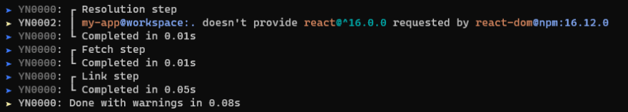
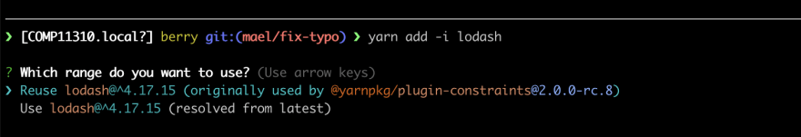
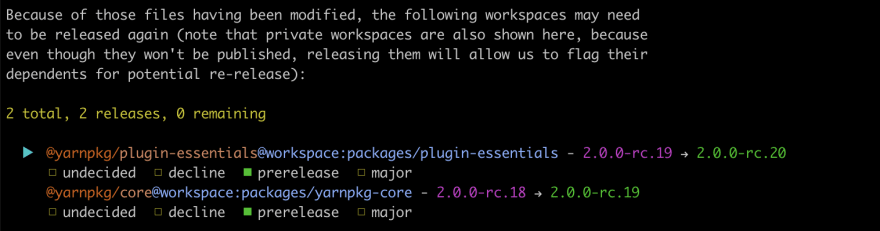

# Source

[[Article] [dev.to] Introducing Yarn 2 ! 🧶🌟](https://dev.to/arcanis/introducing-yarn-2-4eh1)

# CLI Output

Back when Yarn was released its CLI output was a good step forward  compared to other solutions (plus it had emojis! 🧶), but some issues  remained. In particular lots of messages were rather cryptic, and the  colours were fighting against the content rather than working with it.  Strong from this experience, we decided to try something different for  Yarn 2:



Almost all messages now have their own error codes that can be searched within our [documentation](https://next.yarnpkg.com/advanced/error-codes). Here you'll find comprehensive explanations of the in-and-outs of each  message - including suggested fixes. The colours are now used to support the important parts of each message, usually the package names and  versions, rather than on a per-line basis.

We expect some adjustments to be made during the following months (in particular with regard to colour blindness accessibility), but over  time I think you'll come to love this new display!

# Workspace-aware CLI

Working with workspaces can sometimes be overwhelming. You need to  keep the state of your whole project in mind when adding a new  dependency to one of your workspaces. "Which version should I use?  What’s already used by my other workspaces?", etc.

Yarn now facilitates the maintenance of such setups through various means:

- `yarn up ` will upgrade a package in all workspaces at once
- `yarn add -i ` will offer to reuse the same version as the ones used by your other workspaces (and some other choices)
- The [version plugin](https://next.yarnpkg.com/features/release-workflow) will give you a way to check that all the relevant workspaces are bumped when one of them is released again.

Those changes highlight the new experience that we want to bring to Yarn: the tool becomes an ally rather than a burden.



# Zero-Installs

While not a feature in itself, the term "Zero Install" encompasses a  lot of Yarn features tailored around one specific goal - to make your  projects as stable and fast as possible by removing the main source of  entropy from the equation: Yarn itself.

To make it short, because Yarn now reads the vendor files directly  from the cache, if the cache becomes part of your repository then you  never need to run yarn install again. It has a repository size impact,  of course, but on par with the [offline mirror feature](https://yarnpkg.com/blog/2016/11/24/offline-mirror/) from Yarn 1 - very reasonable.

For more details (such as "why is it different from checking in the `node_modules` directory"), refer to  this [documentation page](https://next.yarnpkg.com/features/zero-installs).

# New Command: `yarn dlx`

Yarn 2 introduces a new command called [`yarn dlx`](https://next.yarnpkg.com/cli/dlx) (dlx stands for *download and execute*) which basically does the same thing as [`npx`](https://www.npmjs.com/package/npx) in a slightly less dangerous way. Since `npx` is meant to be used for both local and remote scripts, there is a decent risk that a typo could open the door to an attacker:

```shell
$ npx serv # Oops, should have been "serve"
```

This isn't a problem with dlx, which exclusively downloads and  executes remote scripts - never local ones. Local scripts are always  runnable through yarn run or directly by their name:

```shell
$ yarn dlx terser my-file.js
$ yarn run serve
$ yarn serve
```

# New Command: yarn workspaces foreach

Running a command over multiple repositories is a relatively common  use case, and until now  you needed an external tool in order to do it.  This isn't the case anymore as the [workspace-tools plugin](https://github.com/yarnpkg/berry/tree/master/packages/plugin-workspace-tools) extends Yarn, allowing you to do just that:

```shell
$ yarn workspaces foreach run build
```

The command also supports options to control the execution which  allow you to tell Yarn to follow dependencies, to execute the commands  in parallel, to skip workspaces, and more. Check out the full list of  options [here](https://next.yarnpkg.com/cli/workspaces/foreach).

# New Protocol: patch:

Yarn 2 features a new protocol called `patch:`. This  protocol can be used whenever you need to apply changes to a specific  package in your dependency tree. Its format is similar to the following:

```json
{
  "dependencies": {
    "left-pad": "patch:left-pad@1.3.0#./my-patch.patch"
  }
}
```

Together with the [`resolutions`](https://next.yarnpkg.com/configuration/manifest#resolutions) field, you can even patch a package located deep within your dependency tree. And since the `patch:` protocol is just another data source, it benefits from the same  mechanisms as all other protocols - including caching and checksums!

# New Protocol: `portal:`

Yarn 2 features a new protocol called `portal:`. You can see `portal:` as a package counterpart of the existing `link:` protocol. Where the `link:` protocol is used to tell Yarn to create a symlink to any folder on your local disk, the `portal:` protocol is used to create a symlink to any *package* folder.

```json
{
  "dependencies": {
    "@my/app": "link:./src",
    "eslint-plugin-foo": "portal:./pkgs/eslint-plugin-foo"
  }
}
```

So what's the difference you say? Simple: portals follow transitive  dependencies, whereas links don't. Even better, portals properly follow  peer dependencies, regardless of the location of the symlinked package.

# Workspace Releases

Working with workspaces brings its own bag of problems, and scalable  releases may be one of the largest one. Most of large open-source  projects around here use [Lerna](https://github.com/lerna/lerna) or a similar tool in order to automatically keep track of changes applied to the workspaces.

When we started releasing the beta builds for Yarn 2, we quickly  noticed we would be hitting the same walls. We looked around, but  existing solutions seemed to have significant requirements - for  example, using Lerna you would have to either release all your packages  every time, or to keep track yourself of which packages need to be  released. Some of that work can be automated, but it becomes even more  complex when you consider that a workspace being released may require  unrelated packages to be released again too (for example because they  use it in their prepack steps)!

To solve this problem, we've designed a whole new workflow available through a plugin called [`version`](https://github.com/yarnpkg/berry/tree/master/packages/plugin-version). This workflow, documented [here](https://next.yarnpkg.com/features/release-workflow), allows you to delegate part of the release responsibility to your  contributors. And to make things even better, it also ships with a  visual interface that makes managing releases a walk in the park!



This workflow is sill experimental, but it works well enough for us  that we think it'll quickly prove an indispensable part of your toolkit  when building large projects using workspaces.

# Workspace Constraints

Workspaces quickly proved themselves being one of our most valuable  features. Countless projects and applications switched to them during  the years. Still, they are not flawless. In particular, it takes a lot  of care to keep the workspace dependencies synchronized.

Yarn 2 ships with a new concept called [Constraints](https://next.yarnpkg.com/features/constraints). Constraints offer a way to specify generic rules (using [Prolog](https://en.wikipedia.org/wiki/Prolog), a declarative programming language) that must be met in all of your  workspaces for the validation to pass. For example, the following will  prevent your workspaces from ever depending on underscore - and will be  autofixable!

```
gen_enforced_dependency(WorkspaceCwd, 'underscore', null, DependencyType) :-
  workspace_has_dependency(WorkspaceCwd, 'underscore', _, DependencyType).
```

This other constraint will require that all your workspaces properly describe the repository field in their manifests:

```
gen_enforced_field(WorkspaceCwd, 'repository.type', 'git') :-
  workspace(WorkspacedCwd).

gen_enforced_field(WorkspaceCwd, 'repository.url', 'ssh://git@github.com/yarnpkg/berry.git') :-
  workspace(WorkspacedCwd).
```

Constraints are definitely one of our most advanced and powerful  features, so don't fret yourself if you need time to wrap your head  around it. We'll follow up with blog posts to explore them into details - watch this space!

# Build Dependency Tracking

A recurrent problem in Yarn 1, native packages used to be rebuilt much more than they should have. For example, running `yarn remove` used to completely rebuild all packages in your dependency tree.

Starting from Yarn 2 we now keep track of the individual dependency  trees for each package that lists postinstall scripts, and only run them when those dependency trees changed in some way:

```
➤ YN0000: ┌ Link step
➤ YN0007: │ sharp@npm:0.23.0 must be rebuilt because its dependency tree changed
➤ YN0000: └ Completed in 16.92s
➤ YN0000: Done with warnings in 21.07s
```

# Per-Package Build Configuration

Yarn 2 now allows you to specify whether a build script should run or not on a per-package basis. At the moment the default is to run  everything, so by default you can choose to disable the build for a  specific package:

```json
{
  "dependenciesMeta": {
    "core-js": {
      "built": false
    }
  }
}
```

If you instead prefer to disable everything by default, just toggle off [`enableScripts`](https://next.yarnpkg.com/configuration/yarnrc#enableScripts) in your settings then explicitly enable the [`built`](https://next.yarnpkg.com/configuration/manifest#dependenciesMeta.built) flag in `dependenciesMeta`.

# Normalized Shell

Back when Yarn 2 was still young, the very first external PR we  received was about Windows support. As it turns out Windows users are  fairly numerous, and compatibility is important to them. In particular  they often face problems with the scripts field which is typically only  tested on Bash.

Yarn 2 ships with a rudimentary shell interpreter that knows just  enough to give you 90% of the language structures typically used in the  scripts field. Thanks to this interpreter, your scripts will run just  the same regardless of whether they're executed on OSX or Windows:

```json
{
  "scripts": {
    "redirect": "node ./something.js > hello.md",
    "no-cross-env": "NODE_ENV=prod webpack"
  }
}
```

Even better, this shell allows us to build tighter integrations, such as exposing the command line arguments to the user scripts:

```json
{
  "scripts": {
    "lint-and-build": "yarn lint \"$@\" && yarn build \"$@\""
  }
}
```

# Improved Peer Dependency Links

Because Node calls realpath on all required paths (unless  --preserve-symlinks is on, which is rarely the case), peer dependencies  couldn't work through yarn link as they were loaded from the perspective of the true location of the linked package on the disk rather than from its dependent.

Thanks to Plug’n’Play which can force Node to instantiate packages as many times as needed to satisfy all of their dependency sets, Yarn is  now able to properly support this case.

# New Lockfile Format

Back when Yarn was created, it was decided that the lockfile would  use a format very similar to YAML but with a few key differences (for  example without colons between keys and their values). It proved fairly  annoying for third-party tools authors, as the parser was custom-made  and the grammar was anything but standard.

Starting from Yarn 2, the format for both lockfile and configuration files changed to pure YAML:

```
"@yarnpkg/parsers@workspace:^2.0.0-rc.6, @yarnpkg/parsers@workspace:packages/yarnpkg-parsers":
  version: 0.0.0-use.local
  resolution: "@yarnpkg/parsers@workspace:packages/yarnpkg-parsers"
  dependencies:
    js-yaml: ^3.10.0
    pegjs: ^0.10.0
  languageName: unknown
  linkType: soft
```

# TypeScript Codebase

While it might not directly impact you as a user, we've fully  migrated from Flow to TypeScript. One huge advantage is that our tooling and contribution workflow is now easier than ever. And since we now  allow building Yarn plugins, you'll be able to directly consume our  types to make sure your plugins are safe between updates.

```typescript
export interface Package extends Locator {
  version: string | null,
  languageName: string,
  linkType: LinkType,
  dependencies: Map<IdentHash, Descriptor>,
  peerDependencies: Map<IdentHash, Descriptor>,
  dependenciesMeta: Map<string, Map<string | null, DependencyMeta>>,
  peerDependenciesMeta: Map<string, PeerDependencyMeta>,
};
```

# Modular Architecture

I recently wrote a whole [blog post](https://dev.to/arcanis/plugin-systems-when-why-58pp) on the subject so I won't delve too much into it, but Yarn now follows a very modular architecture.

In particular, this means two interesting things:

- You can write plugins that Yarn will load at runtime, and that  will be able to access the true dependency tree as Yarn sees it; this  allows you to easily build tools such as [Lerna](https://lerna.js.org/), [Femto](https://fable.io/blog/Introducing-Femto.html), [Patch-Package](https://github.com/ds300/patch-package), ...
- You can have a dependency on the Yarn core itself and instantiate the classes yourself (note that this part is still a bit experimental  as we figure out the best way to include the builtin plugins when  operating under this mode).

To give you an idea, we've built a [typescript plugin](https://github.com/yarnpkg/berry/tree/master/packages/plugin-typescript) which will automatically add the relevant `@types/` packages each time you run `yarn add`. Plugins are easy to write - we even have a [tutorial](https://next.yarnpkg.com/advanced/plugin-tutorial) -, so give it a shot sometime!

# Normalized Configuration

One very common piece of feedback we got regarding Yarn 1 was about  our configuration pipeline. When Yarn was released we tried to be as  compatible with npm as possible, which prompted us to for example try to read the npm configuration files etc. This made it fairly difficult for our users to understand where settings should be configured.

```
initScope: yarnpkg
npmPublishAccess: public
yarnPath: scripts/run-yarn.js
```

In Yarn 2, the whole configuration has been revamped and everything is now kept within a single source of truth named `.yarnrc.yml`. The settings names have changed too in order to become uniform (no more `experimental-pack-script-packages-in-mirror` vs `workspaces-experimental`), so be sure to take a look at our shiny new [documentation](https://next.yarnpkg.com/configuration/yarnrc).

# Strict Package Boundaries

Packages aren't allowed to require other packages unless they  actually list them in their dependencies. This is in line with the  changes we made back when we introduced Plug'n'Play [more than a year ago](https://github.com/yarnpkg/rfcs/pull/101), and we're happy to say that the work we've been doing with the top  maintainers of the ecosystem have been fruitful. Nowadays, very few  packages still have compatibility issues with this rule.

```javascript
// Error: Something that got detected as your top-level application
// (because it doesn't seem to belong to any package) tried to access
// a package that is not declared in your dependencies
// 
// Required package: not-a-dependency (via "not-a-dependency")
// Required by: /Users/mael/my-app/
require(`not-a-dependency`);
```

# Deprecating Bundle Dependencies

Bundle dependencies are an artefact of another time, and all support  for them has been dropped. The installs will gracefully degrade and  download the packages as originally listed in the dependencies field.

```json
{
  "bundleDependencies": [
    "not-supported-anymore"
  ]
}
```

Should you use bundle dependencies, please check the [Migration Guide](https://next.yarnpkg.com/advanced/migration) for suggested alternatives.

# Read-Only Packages

Packages are now kept within their cache archives. For safety and to  prevent cache corruptions, those archives are mounted as read-only  drives and cannot be modified under normal circumstances:

```typescript
const {writeFileSync} = require(`fs`);
const lodash = require.resolve(`lodash`);

// Error: EROFS: read-only filesystem, open '/node_modules/lodash/lodash.js'
writeFileSync(lodash, `module.exports = 42;`);
```

If a package needs to modify its own source code, it will need to be [unplugged](https://next.yarnpkg.com/advanced/lexicon#unplugged-package) - either explicitly in the [`dependenciesMeta` field](https://next.yarnpkg.com/configuration/manifest#dependenciesMeta.unplugged), or implicitly by listing a postinstall script.

# Conclusion

Wow. That's a lot of material, isn't it? I hope you enjoy this  update, it's the culmination of literally years of preparation and  obstinacy.

Everything I believe package management should be, you'll find it  here. The result is for sure more opinionated than it used to be, but I  believe this is the way going forward - a careful planning of the long  term user experience we want to provide, rather than a toolbox without  directions.

As for me, working on Yarn has been an incredible experience. I'm  simultaneously project manager, staff engineer, lead designer, developer relations, and user support. There are ups and downs, but every time I  hear someone sharing their Yarn success story my heart is internally  cheering a little bit. So do this: [tell me what you like](https://discord.gg/yarnpkg), and help fix what you don't.

