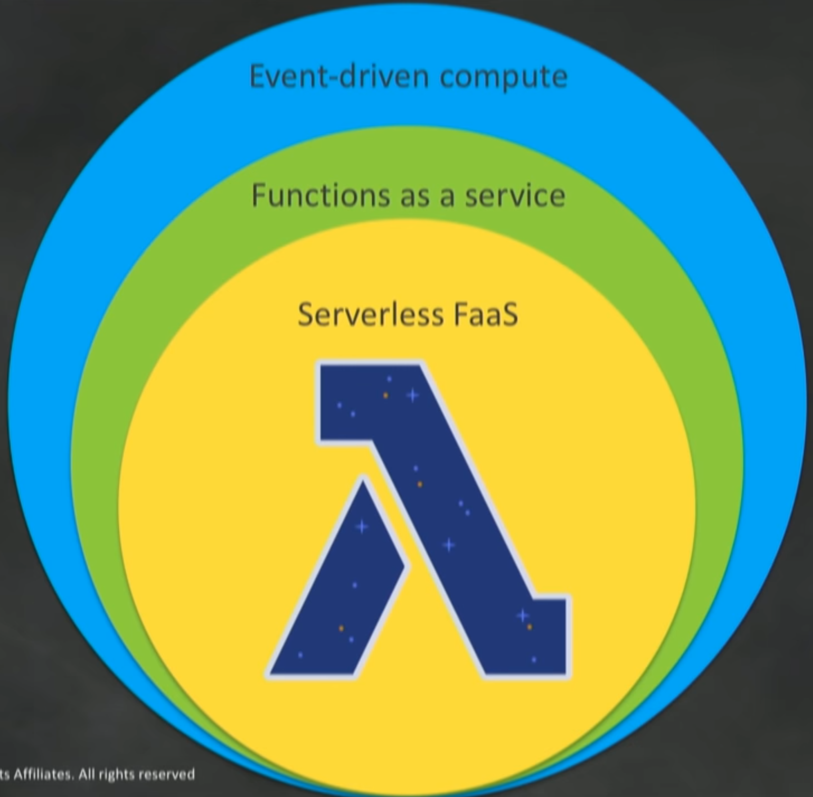
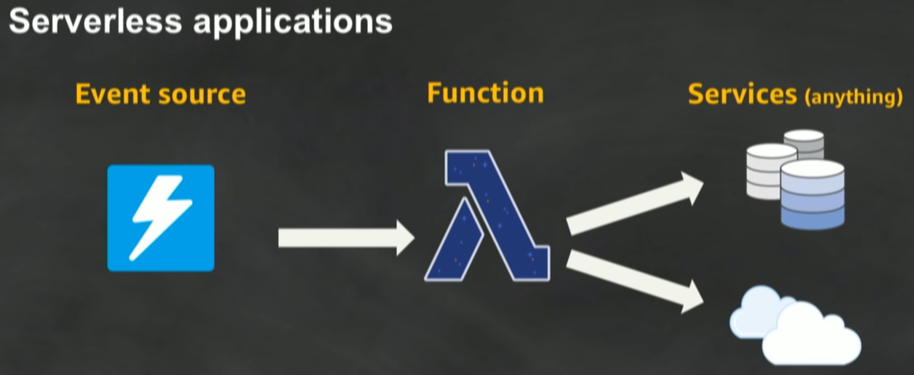
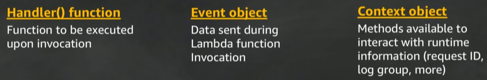
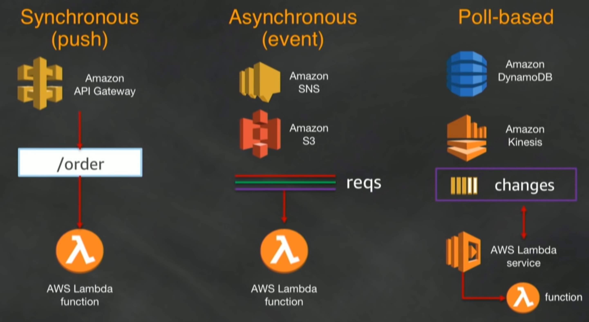
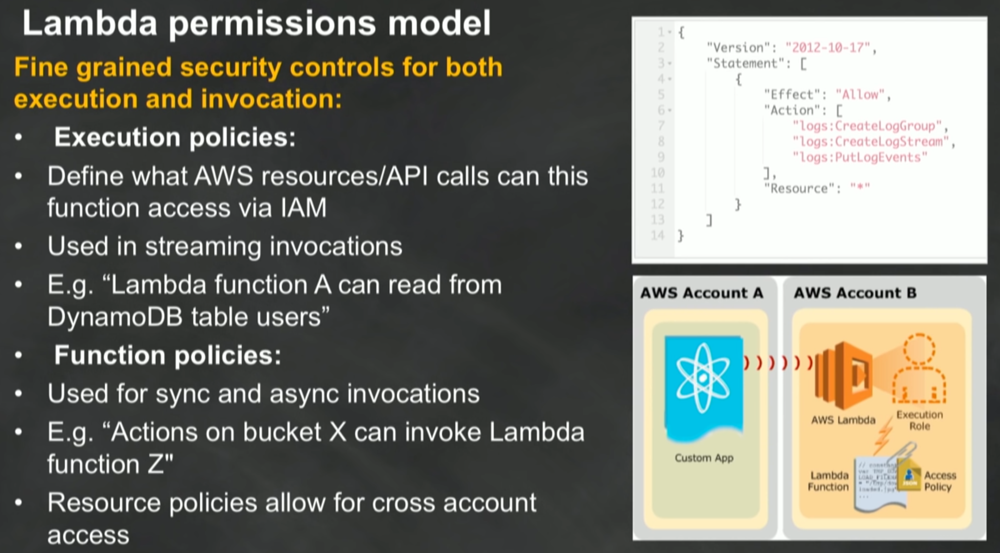

# Source

[Introduction to AWS Lambda & Serverless Applications](https://www.youtube.com/watch?v=EBSdyoO3goc)

# 4 AWS criteria defining serverless

1. No servers to provision or manage - no physical or virtual servers
2. Scales with usage - as request/event/data come in the platform of serverless should automatically scale
3. Pay for value
4. Availability & fault tolerance built in

Popularity of microservices contributes to raise of "event driven compute". The individual actions and flows imagined as workflows and aligning those as different functions "function as a service"

# Lambda handles

- Load balancing
- Auto scaling
- Handling Failures
- Security isolation
- OS Management
- managing utilization

# Supported runtimes

- NodeJS
- Python
- Java
- C#
- Go
- Ruby
- Runtime API - able to add custom runtime. Able to use any language with it.

# Anatomy of Lambda

# Lambda execution models

# Lambda permission model

Who can invoke my function? To what my function has access?

# Amazon API Gateway

Mainly used for:

- Create a unified Api frontend for multiple microservices
- DDoS protection and throttling of your backend
- Authenticate and authorize requests to a backend
- Throttle, meter and monetize API usage by third party developers

Note: API Gateway can store the state required for Websockets to work with Lambda. Lambda is stateless and cant handle Web sockets on its own