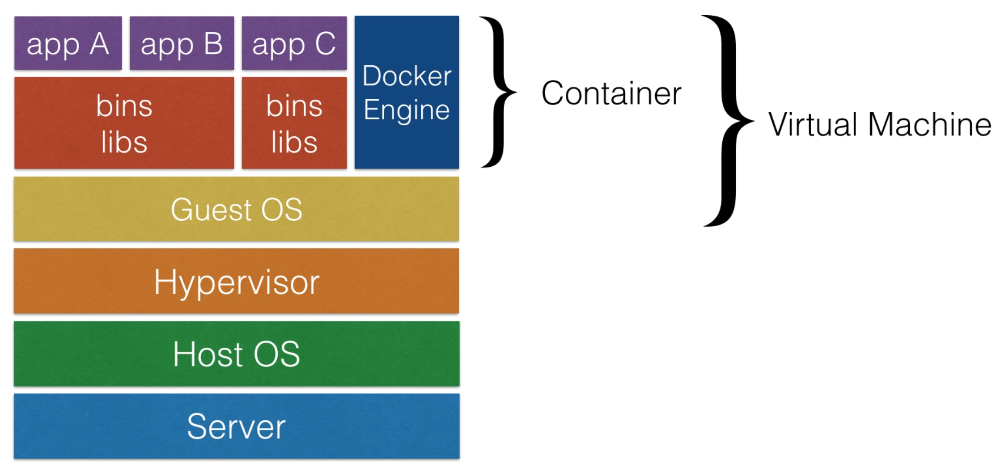

# Source

[[Udemy] [Course] Learn DevOps: The Complete Kubernetes Course](https://www.udemy.com/course/learn-devops-the-complete-kubernetes-course/)

# What is Kubernetes?

Its highly modular open source orchestration system for Docker containers backed by Google.

## Kubernetes allows you to

- schedule containers on a cluster of machines
- run multiple containers on one machine
- run long running services (like web applications)
- have the state of the containers managed by Kubernetes
  - can start the container on specific nodes
  - can restart a container when it gets killed
  - can move containers from one node to another node

Instead of just running a few docker containers on one host manually, Kubernetes is a platform that will manage the containers for you. Kubernetes clusters can start with one node until thousands of nodes

## Other docker orchestrators

- Docker swarm - comes out of the box with docker but not as extensive as Kubernetes

- Mesos - built to run many different container types. Docker is just one of the supported

## Where can Kubernetes be run?

- on-premise (own datacenter)
- public (GCP, AWS)
- Hybrid: public & private

# Containers

## Virtual Machines vs Containers


Virtual machine has a server (physical machine) which has a Host OS with installed Hypervisor. The Hypervisor is managing the Guest OS and you can have multiple guest OS. A VM is very heavy and takes a lot of time to bootup.

Container doesnt need to boot a guest OS so it its almost an instant start. Containers are usually a few MB compared to a lot more for VMs.

### Containers on Cloud providers



## Docker

Docker is the most popular container software. An alternative to Docker is "rkt" which also works with Kubernetes

Docker engine is the Docker runtime. Its the software to build & run docker images.

Docker Hub is an online service to store and fetch docker images. It also allows you to build docker images online. You can host your own docker repository.

### Docker benefits

- Isolation - you ship your binary with all the dependencies
  - no more "it works on my machine, but not in production"
- Closer parity between dev, qa, and production environments
- Docker makes development teams able to ship faster
- You can run the same docker image, unchanged, on laptops, data center VMs and cloud proiders
- Docker uses Linux Containers (a kernel feature) for operating system level isolation

## Kubernetes setups

- kubernetes should really be able to run anywhere
- But there are more integration for certain cloud providers like AWS & GCE
  - Things like Volumes and External Load Balancers work only with supported Cloud Providers

## Local experiments with Minikube & Kubernetes

Minikube is a tool that makes it easy to run Kubernetes locally. Minikube runs a single-node Kubernetes cluster inside a Virtual Machine (VM) on your laptop for users looking to try out Kubernetes or develop with it day-to-day.

### Installing & running minikube

`brew install minikube`

A VM driver will be automatically selected. "hyperkit" is prefered on mac.

`minikube start`

Minikube sets kubectl to use "minikube" - the configuration is stored at `~/.kube/config`

### Testing minikube cluster

`minikube dashboard` - to access the Kubernetes Dashboard running within the minikube cluster

`kubectl create deployment hello-minikube --image=k8s.gcr.io/echoserver:1.4` - if you would like to test the cluster with a test image called "echoserver"

`kubectl expose deployment hello-minikube --type=NodePort --port=8080` - expose a service as a NodePort

`minikube service hello-minikube` - easily opens the exposed endpoint in your browser

`minikube start -p cluster2` - start a second local cluster (note: this will not work if minikube is using the bare-metal/none driver)

`minikube stop` - stop your local cluster

`minikube delete` - when cant recover from error or would like to make sure the minikube VM is removed

## Production grade cluster tools

minikube/docker client are good for local installs, but not suitable for production cluster

`kops` and `kubeadm` are tools to spin up a production cluster.

`kops` is prefered for AWS, there are some AWS integrations. `kubeadm` is a generic solution.

## Kops

kops stands for "Kubernetes Operations". The tool allows you to do production grade Kubernetes installations, upgrades and management.

Kops works only on Mac/Linux. On windows a VM will have to be started first. You can use Virtualbox & Vagrant

There is also a legacy tool called kube-up.sh which was a simple tool to bring up cluster, but is now deprecated. It doesnt create a production ready environment.

## Kops & AWS setup

### How to pick a region in AWS

check the ping at https://www.cloudping.info/

## Building Docker images

Dockerizing a simple nodeJS app only needs a few files:

- Dockerfile

```dockerfile
FROM node:4.6
WORKDIR /app #changes the execution directory for RUN, CMD, ENTRYPOINT, COPY and ADD instructions
ADD . /app
RUN npm install
EXPOSE 3000
CMD npm start
```

- index.js

```javascript
var express = require('express');
var app = express();

app.get('/', (req, res) => {
	res.send('Hello world');
});

var server = app.listen(3000, () => {
	var host = server.address().address;
  var port = server.address().port;
  
  console.log('Example app listening at ....', host, port);
});
```

- package.json

```json
{
	"scripts": {
		"start": "node index.js"
	}
}
```

### Manually build the image

`docker build .`

After the docker build process you have built an image that can run the nodejs app

# Cheatsheet: Docker commands 

Build image: `docker build .`

Build & Tag: `docker build -t wardviaene/k8s-demo:latest .`

Tag image: `docker tag imageid wardviaene/k8s-demo`

Push image: `docker push wardviaene/k8s-demo`

List images: `docker images`

List all containers: `docker ps -a`

# Cheatsheet: Kubernetes commands

`kubectl get pod`: Get information about all running pods

`kubectl describe pod <pod>`: Describe one pod

`kubectl expose pod <pod> --port=444 --name=frontend`: Expose the port of a pod (creates a new service)

`kubectl port-forward <pod> 8080`: Port forward the exposed pod port to your local machine

`kubectl attach <podname> -i`: Attach to the pod

`kubectl exec <pod> -- command`: Execute a command on the pod

`kubectl label pods <pod> mylabel=awesome`: Add a new label to a pod

`kubectl run -i --tty busybox --image=busybox --restart=Never -- sh`: Run a shell in a pod - very useful for debugging

`kubectl get deployments`: Get information on current deployments

`kubectl get rs`: Get information about the replica sets

`kubectl get pods --show-labels`: get pods, and also show labels attached to those pods

`kubectl rollout status deployment/helloworld-deployment`: Get deployment status

`kubectl set image deployment/helloworld-deployment k8s-demo=k8s-demo:2`: Run k8s-demo with the image label version 2

`kubectl edit deployment/helloworld-deployment`: Edit the deployment object

`kubectl rollout status deployment/helloworld-deployment`: Get the status of the rollout

`kubectl rollout history deployment/helloworld-deployment`: Get the rollout history

`kubectl rollout undo deployment/helloworld-deployment`: Rollback to previous version

`kubectl rollout undo deployment/helloworld-deployment --to-revision=n`: Rollback to any version version

# AWS Commands cheatsheet

`aws ec2 create-volume --size 10 --region us-east-1 --availability-zone us-east-1a --volume-type gp2`

# Certificates cheatsheet

Creating a new key for a new user: `openssl genrsa -out myuser.pem 2048`

Creating a certificate request: `openssl req -new -key myuser.pem -out myuser-csr.pem -subj "/CN=myuser/O=myteam/"`

Creating a certificate: `openssl x509 -req -in myuser-csr.pem -CA  /path/to/kubernetes/ca.crt -CAkey /path/to/kubernetes/ca.key  -CAcreateserial -out myuser.crt -days 10000`

# Abbreviations used

Resource type: Abbreviated alias

configmaps: cm

customresourcedefinition: crd

daemonsets: ds

deployments deploy

horizontalpodautoscalers: hpa

ingresses ing

limitranges limits

namespaces: ns

nodes: no

persistentvolumeclaims: pvc

persistentvolumes: pv

pods: po

replicasets: rs

replicationcontrollers: rc

resourcequotas: quota

serviceaccounts: sa

services: svc