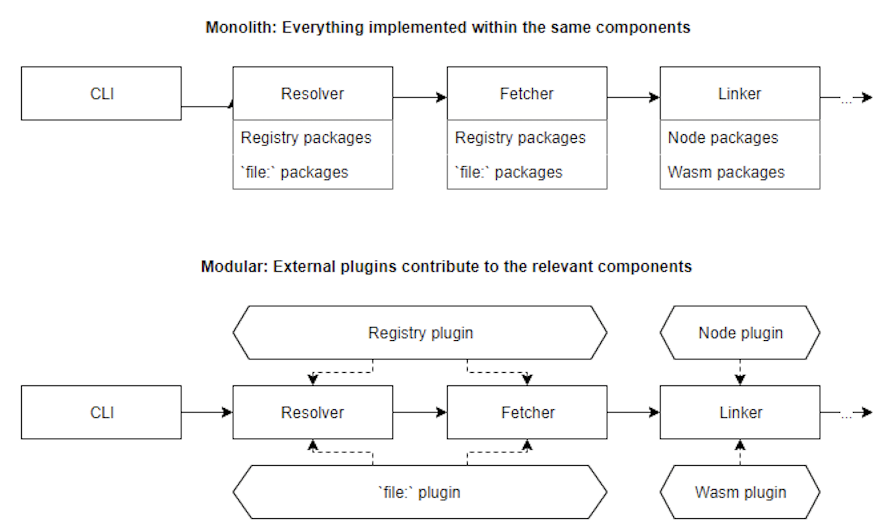
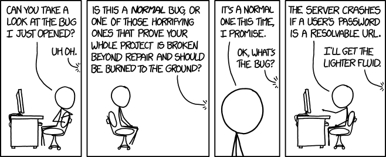

# Source

[[Article] [dev.to] Plugin systems - when & why?](https://dev.to/arcanis/plugin-systems-when-why-58pp)

# Plugins are boundaries

Imagine the same application implemented twice - the first time as a monolith, and the second time with a typical core + plugins architecture. Now you need to build a new feature:

- With the monolithic application, you'll likely be able to do your  assignment by tweaking a few modules here and there, adding a few new  branches, and possibly adding new fields to the data structures. You may not even need to create new files!

- With a well-designed plugin system, it'll be more difficult - you'll  need to make sure that your changes go through the predefined core  hooks. You won't be able to just change the core logic to fit your new  need, so you think hard about the implementation before even starting to code.

  

The monolithic application sounds better, right? Easier to work with, faster iterations. And that's true, given the few parameters I've exposed! But now consider those additional ones:

- Multiple people will work on the codebase. There's even a non-zero chance that no one from the current maintainer team will be there in a year. Worse: it's also quite likely that no one from the current maintainer team was here even a year ago.
- Most contributors only ever make a single commit - to fix the one bug they experience. They won't ever come back, and probably don't have any context regarding why things work the way they do.
- This software will be used for years, and its userbase will keep growing.

Under those new parameters, the monolith will quickly start to spiral  out of control. New features get developed and injected into the core.  When something isn't quite possible yet, a few small hacks are used. And it works! Time flows, contributors come and go, and suddenly you start  to notice a weird pattern: each feature you develop introduces new bugs. People send PRs to help you fix those bugs, but introduce new ones in  the process. Long-forgotten hacks trigger edge cases more and more  often. Technical debt creeps in and, eventually, we come to a point  where no one dares to make a change.

The plugin architecture, however, survives. Bugs still happen, but  because the broken features are typically scoped to a single plugin  people who aim to fix them only have to understand the context of the  one affected module instead of the whole codebase. Same things for  reviews, which can be done by people familiar with the individual  plugins rather than the whole application. Core maintainers can focus on the core work, and delegate the plugin implementation to new  contributors.

The monolith application is Yarn 1 and its hardcoded code paths. The plugin architecture is Yarn 2 and its specialized hooks.

# Plugins give focus

Working on an open-source project the size of Yarn is challenging for various reasons, but the one we'll focus on in this article is pretty  simple: what are the features worth implementing?

Lots of people use Yarn every day and, as a result, we get a lot of  pull requests to add new features into our tool. Each time, when we're  about to merge them, the same questions pop into our minds: will it be  useful? Is it worth the complexity? Will I feel comfortable having to  maintain this myself in a year?

Back in the v1, our typical answers were along the line of "well,  let's move forward and see what happens". But I can already tell you  what happens: some of those features became cornerstones of our offering (like workspaces, or resolution overrides) while others ended up  cluttering our codebase (like Bower support, or multilingual support).  In almost every case even though the implementations worked in  isolation, they happened to hit some weird edge case when used together  with other features.

Plugin systems offer a very simple solution to this problem by stating that **not everything has to belong to the core**. It becomes perfectly fine if a lot of features are first implemented  through community plugins, the time we can assess their cost/value  ratio.

Even better, if we someday decide that a feature shouldn't be shipped anymore, it's just a matter of removing the plugin from the codebase.  Of course, such actions sometimes make parts of the core irrelevant and  subject to changes. Thankfully, the resources freed by outsourcing part  of the feature development can then be reassigned to allow maintainers  to spend more timing on keeping up to date the most critical part of  their software: the core itself.

# Conclusion

Plugins aren't good in every scenario. In particular, they can only  be designed once you already have a perfect knowledge of the design  space - or at least good enough to know exactly what are the parts  you're still missing.

In my case, for example, it took almost two years before I finally  felt confident enough about package managers to bootstrap the project.  Before that, I spent my time writing various package manager  implementations, various tentative APIs, all to grasp the extent of what we would need to cover. It's only after failing a few times that I  decided we were ready to go.

So plugins are dangerous. They might put you off the trail, looking  for the mysterious cities of gold rather than building your fort. Still, in the case of popular open-source projects, I believe using a modular  architecture offers some very strong advantages that go far beyond the  idea that people may have in mind when thinking about plugins. More than just a way to open your project to new features, they also provide  crucial structure and support, helping those projects to stand the test  of time.