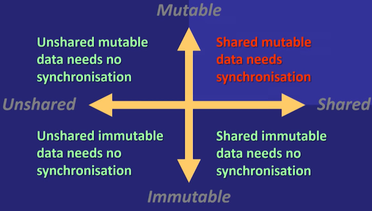

# Source

[[YouTube] Refactoring to Immutability - Kevlin Henney](https://www.youtube.com/watch?v=APUCMSPiNh4)

# Why immutability

- **understandable code by minimizing moving parts** - Its easier to reason about it when there are less moving parts because there are less things to break and less possible program states.

- **Idempotence** - asking the question shouldnt change the answer

- **multithread safety**

  

  

# What is "Technical Debt"

> As an envolving program is continually changed, its complexity reflecting deteriorating structure increases unless work is done to maintain or reduce it
>
> Meir M Lehman (1980)

# Coding styles

> Many programming languages support programming in both functional and  imperative style but the syntax and facilities of a language are typically optimised for only one of these styles, and social factors like coding conventions and libraries often force the programmer towards one of the styles.
>
> https://wiki.haskell.org/Functional_programming

# Method chaining (except fluent API)

Digging down in the object properties multiple levels breaks the Law of Demeter and introduces tight Coupling

> - Each unit should have only limited knowledge about other units: only units "closely" related to the current unit.
> - Each unit should only talk to its friends; don't talk to strangers.
> - Only talk to your immediate friends.
>
> https://en.wikipedia.org/wiki/Law_of_Demeter

# Immutable value

> Define a value object type whose instances are immutable. The internal state of a value object is set at construction and no subsequent modifications are allowed
>
> Immutable value

# How to make code immutable?

- **remove modifiers** - remove unused modifiers(e.g. setters) and consider Replace Modifiers with Constructors, Extract modifiers to Builder and Make Void Methods Fluent
  - replace "setters" with methods expressing the changes
- **Replace Modifications With Constructors** - many sequences of modifications can often be replaced with a broader set of meaningful constructors
- **Move modifiers to builder** - define a mutable companion class to handle sequences of modification (cf. String and StringBuilder)
- **Replace Side Effect with new Object** - return a new object instead of changing an existing one. Often make void methods fluent is a useful stepping stone
- **make void methods fluent** - have a method return an existing or new object the caller can chain from
  - make methods expressing change to return a new instance containing the change. Dont apply directly the change to the current instance

> In computing, a persistent data structure is a data structure that always preserves the previous version of itself when it is modified. Such data structures are effectively immutable, as their operations do not (visibily) update the structure in-place, but instead always yield a new updated structure
>
> (A persistent data structure is not a data structure committed to persistent storage, such as a disk; this is a different and unrelated sense of the word "persistent")
>
> (wiki) Persistent Data structure

# Readability between coding styles

# How to remove code noise?

Code noise - repeating boilerplate code

> Try to leave out the part that readers tend to skip
>
> Elmore Leonard

- **Extract iteration** - repetition is repetitive, so factor out common loops into appropriately named and parametised methods
- **extract control flow as Higher-Order Functions** - much control flow has stable structure but variable conditions or actions, so use pluggable behaviour
- **Replace control flow with data structure** - many data structures embody control intelligence, e.g. sorted collections and regular expressions, so replace long-hand logic and control with more intelligent data structures
- **Replace control flow with data flow** - use pipelines, polymorphism and higher order methods to replace control flow with data flow
- **Replace loop with stream filtering** - use collection pipelines to replace explicit looping and control flow with data flow