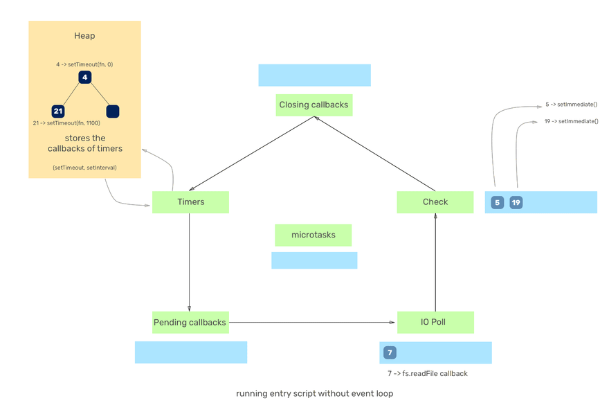

# Source

[[Article] Understanding the Node.js event loop phases and how it executes the JavaScript code](https://dev.to/lunaticmonk/understanding-the-node-js-event-loop-phases-and-how-it-executes-the-javascript-code-1j9)

# Event loop

The event loop is basically a mechanism which has certain phases through which it iterates. You must also have heard about a term called 'Event  Loop iteration' which implies an iteration of event loop over all of its phases.

Following is the diagram of what all phases an event loop iterates through as per their order


So, the event loop is a mechanism in Node.js which iterates over a  series of in loop. Following are the phases that the event loop iterates through:

Each of the phases has a queue/heap which is used by the event loop  to push/store the callbacks to be executed (There is a misconception in  Node.js that there is only a single global queue where the callbacks are queued for execution which is not true.).

# Event loop phases

Apart from the listed below, there is one more `microtask` queue which contains callbacks associated with `process.nextTick` which we will see in a bit.

## Timers

The callbacks of timers in JavaScript(setTimeout, setInterval) are kept  in the heap memory until they are expired. If there are any expired  timers in the heap, the event loop takes the callbacks associated with  them and starts executing them in the ascending order of their delay  until the timers queue is empty. However, the execution of the timer  callbacks is controlled by the *Poll* phase of the event loop (we will see that later in this article).

## Pending callbacks

In this phase, the event loop executes system-related callbacks if any.  For example, let's say you are writing a node server and the port on  which you want to run the process is being used by some other process,  node will throw an error `ECONNREFUSED`, some of the *nix  systems may want the callback to wait for execution due to some other  tasks that the operating system is processing. Hence, such callbacks are pushed to the pending callbacks queue for execution.

## Idle/Prepare

In this phase, the event loop does nothing. It is idle and prepares to go to the next phase.

## Poll

This phase is the one which makes Node.js unique. In this phase, the  event loop watches out for new async I/O callbacks. Nearly all the  callbacks except the setTimeout, setInterval, setImmediate and closing  callbacks are executed.

Basically, the event loop does two things in this phase:

1. If there are already callbacks queued up in the poll phase queue, it will execute them until all the callbacks are drained up from the poll  phase callback queue.
2. If there are no callbacks in the queue, the event loop will stay in  the poll phase for some time. Now, this 'some time' also depends on a  few things:
   - If there are any callbacks present in the setImmediate queue to be  executed, event loop won't stay for a much longer time in the poll phase and will move to the next phase i.e Check/setImmediate. Again, it will  start executing the callbacks until the Check/setImmediate phase  callback queue is empty.
   - The second case when the event loop will move from the poll phase is when it gets to know that there are expired timers, the callback of  which are waiting to be executed. In such a case, the event loop will  move to the next phase i.e Check/setImmediate and then to the Closing  callbacks phase and will eventually start its next iteration from the  timers phase.

## Check/setImmediate

In this phase, the event  loop takes the callbacks from the Check phase's queue and starts  executing one by one until the queue is empty. The event loop will come  to this phase when there are no callbacks remaining to be executed in  the poll phase and when the poll phase becomes idle. Generally, the  callbacks of setImmediate are executed in this phase.

## Closing callbacks

In this phase, the event loop executes the callbacks associated with the closing events like `socket.on('close', fn)` or `process.exit()`.

# Examples

## Example 1

```javascript
function main() {
  setTimeout(() => console.log('1'), 0);
  setImmediate(() => console.log('2'));
}

main();
// Output:
// 1
// 2
// Also can be reversed to:
// 2
// 1
```

The event loop enters the `Timers` phase and executes the callback associated with the `setTimeout` above after which it enters the subsequent phases where it doesn't see any callbacks enqueued until it reaches the `Check (setImmediate)` phase where it executes the callback function associated with it. Hence the desired output.

Note: The above output can be reversed too i.e since the event loop doesn't execute the callback of setTimeout(fn,  0) exactly in 0ms time. It executes the callback after a bit of delay  somewhat after 4-20 ms. (Remember?, it was earlier mentioned that the *Poll* phase controls the execution of the timer callbacks since it waits for some I/O in the poll phase).

Now, there are two things which happen when any JavaScript code is run by the event loop.

1. When a function in our JavaScript code is called, the event loop  first goes without actually the execution to register the initial  callbacks to the respective queues.
2. Once they are registered, the event loop enters its phases and  starts iterating and executing the callbacks until all them are  processed.

One more example or let's say there is a misconception in Node.js  that setTimeout(fn, 0) always gets executed before setImmediate, which  is not at all true! As we saw in the above example, the event loop was  in the Timers phase initially and maybe the setTimeout timer was expired and hence it executed it first and this behaviour is not predictable.  However, this is not true always, it all depends on the number of  callbacks, what phase the event loop is in, etc.

## Example 2

```javascript
function main() {
  fs.readFile('./xyz.txt', () => {
    setTimeout(() => console.log('1'), 0);
    setImmediate(() => console.log('2'));
  });
}

main();
// Will always output
// 2
// 1
```

Let us see how the above code is executed:

1. As we call our `main()` function, the event loop first runs without actually executing the callbacks. We encounter the  fs.readFile with a callback which is registered and the callback is  pushed to the I/O phase queue. Since all the callbacks for the given  function are registered, the event loop is now free to start execution  of the callbacks. Hence, it traverses through its phases starting from  the timers. It doesn't find anything in the Timers and Pending callbacks phase.
2. When the event loop keeps traversing through its phases and when  it sees that the file reading operation is complete, it starts executing the callback.

**Remember, when the event loop starts executing the callback of `fs.readFile`, it is in the I/O phase, after which, it will move to the Check(setImmediate) phase.**

1. Thus, the **Check** phase comes before the **Timers** phase for the current run. Hence, when in I/O phase, the callback of `setImmediate` will always run before `setTimeout(fn, 0)`.

## Example 3

```javascript
function main() {
  setTimeout(() => console.log('1'), 50);
  process.nextTick(() => console.log('2'));
  setImmediate(() => console.log('3'));
  process.nextTick(() => console.log('4'));
}

main();
// Output
// 2
// 4
// 3
// 1
```

> **The process.nextTick comes under `microtasks` which  are prioritised above all other phases and thus the callback associated  with it is executed just after the event loop finishes the current  operation.** Which means that, whatever callback we pass to  process.nextTick, the event loop will complete its current operation and then execute callbacks from the `microtasks` queue until it is drained up. Once the queue is drained up, it returns back to the phase where it left its work from.

1. It first checks the `microtask` queue and executes the callbacks in it(process.nextTick callbacks in this case).
2. It then enters its very first phase (Timers phase) where the 50ms  timer is not yet expired. Hence it moves forward to the other phases.
3. It then goes to the 'Check (setImmediate)' phase where it sees the timer expired and executes the callback which logs '3'.
4. In the next iteration of the event loop, it sees the timer of 50ms expired and hence logs down '1'.

## Example 4

```javascript
function main() {
  setTimeout(() => console.log('1'), 50);
  process.nextTick(() => console.log('2'));
  setImmediate(() => console.log('3'));
  process.nextTick(() => setTimeout(() => {
    console.log('4');
  }, 1000));
}

main();
// Output
// 2
// 3
// 1
// 4
```

Now, here is what happens when the above code is executed:

1. All the callbacks are registered and pushed to their respective queues.
2. Since the `microtasks` queue callbacks are executed first as seen in the previous examples, '2' gets logged. Also, at this time,  the second process.nextTick callback i.e setTimeout(which will log '4')  has started its execution and is ultimately pushed to the 'Timers' phase queue.
3. Now, the event loop enters its normal phases and executes callbacks. The first phase that it enters is 'Timers'. It sees that the timer of  50ms is not expired and hence moves further to the next phases.
4. It then enters 'Check (setImmediate)' phase and executes the callback of setImmediate which ultimately logs '3'.
5. Now, the next iteration of the event loop begins. In it, the event  loop returns back to the 'Timers' phase, it encounters both the expired  timers i.e 50ms and 1000ms as per their registering, and executes the  callback associated with it which logs first '1' and then '4'.

Thus, as you saw the various states of event loop, its phases and most importantly, `process.nextTick` and how it functions. It basically places the callback provided to it in the `microtasks` queue and executes it with priority.

## Example 5

```javascript
const fs = require('fs');
 
function main() {
	setTimeout(() => console.log('1'), 0);
	setImmediate(() => console.log('2'));

	fs.readFile('./xyz.txt', (err, buff) => {
		setTimeout(() => {
			console.log('3');
		}, 1000);

		process.nextTick(() => {
			console.log('process.nextTick');
		});

		setImmediate(() => console.log('4'));
    });

    setImmediate(() => console.log('5'));

    setTimeout(() => {
    	process.on('exit', (code) => {
    		console.log(`close callback`);
    	});
    }, 1100);
}

main();

// Output
// 1
// 2
// 5
// process.nextTick
// 4
// 3
// close callback

// It can also output
// 2
// 5
// 1
// process.nextTick
// 4
// 3
// close callback
```

Note: 

1. **The numbers in the queues indicated in the following gif are the line number of the callbacks in the above code.**
2. **Since my focus is on how event loop phases execute the code, I haven't inserted the Idle/Prepare phase in the gif since it is used  internally only by the event loop.**



# Misc

## Microtasks and Macrotasks

### Microtasks

So, there is a thing in Node.js or say v8 to be accurate called  'Microtasks'. Microtasks are not a part of the event loop and they are a part of v8, to be clear. Earlier, in this article, you may have read  about `process.nextTick`. There are some tasks in JavaScript which come under Microtasks namely `process.nextTick`, `Promise.resolve`, etc.

These tasks are prioritised over other tasks/phases meaning that the  event loop after its current operation will execute all the callbacks of the `microtasks` queue until it is drained up after which it resumes its work from the phase it left its work from.

Thus, whenever Node.js encounters any `microtask` defined above, it will push the associated callback to the `microtask` queue and start the execution right away(microtasks are prioritised)  and execute all the callbacks until the queue is drained up thoroughly.

That being said, if you put a lot of callbacks in the `microtasks` queue, you may end up starving the event loop since it will never go to any other phase.

### Macrotasks

Tasks such as `setTimeout`, `setInterval`, `setImmediate`, `requestAnimationFrame`, `I/O`, `UI rendering`, or other `I/O callbacks` come under the macrotasks. They have no such thing as prioritisation by the event loop. The callbacks are executed according to the event loop  phases.

## Event loop tick

We say that a 'tick' has happened when the event loop iterates over  all of its phases for one time (one iteration of the event loop).
High event loop tick frequency and low tick duration(time spent in one iteration) indicates the healthy event loop.