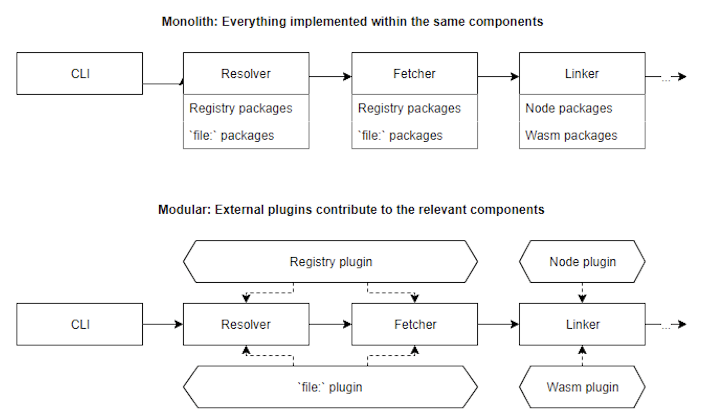
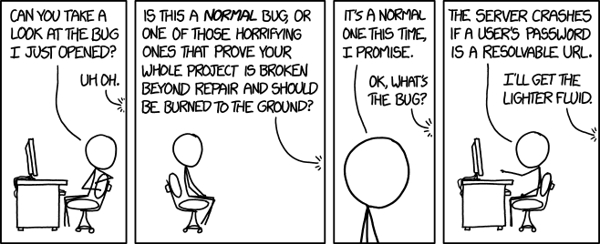

# Plugins are boundaries

Imagine the same application implemented twice - the first time as a monolith, and the second time with a typical core + plugins architecture. Now you need to build a new feature:

- With the monolithic application, you'll likely be able to do your  assignment by tweaking a few modules here and there, adding a few new  branches, and possibly adding new fields to the data structures. You may not even need to create new files!

- With a well-designed plugin system, it'll be more difficult - you'll  need to make sure that your changes go through the predefined core  hooks. You won't be able to just change the core logic to fit your new  need, so you think hard about the implementation before even starting to code.

  
  
  

The monolithic application sounds better, right? Easier to work with, faster iterations. And that's true, given the few parameters I've exposed! But now consider those additional ones:

- Multiple people will work on the codebase. There's even a non-zero chance that no one from the current maintainer team will be there in a year. Worse: it's also quite likely that no one from the current maintainer team was here even a year ago.
- Most contributors only ever make a single commit - to fix the one bug they experience. They won't ever come back, and probably don't have any context regarding why things work the way they do.
- This software will be used for years, and its userbase will keep growing.

Under those new parameters, the monolith will quickly start to spiral  out of control. New features get developed and injected into the core.  When something isn't quite possible yet, a few small hacks are used. And it works! Time flows, contributors come and go, and suddenly you start  to notice a weird pattern: each feature you develop introduces new bugs. People send PRs to help you fix those bugs, but introduce new ones in  the process. Long-forgotten hacks trigger edge cases more and more  often. Technical debt creeps in and, eventually, we come to a point  where no one dares to make a change.

The plugin architecture, however, survives. Bugs still happen, but  because the broken features are typically scoped to a single plugin  people who aim to fix them only have to understand the context of the  one affected module instead of the whole codebase. Same things for  reviews, which can be done by people familiar with the individual  plugins rather than the whole application. Core maintainers can focus on the core work, and delegate the plugin implementation to new  contributors.

Plugins aren't good in every scenario. In particular, they can only  be designed once you already have a perfect knowledge of the design  space - or at least good enough to know exactly what are the parts  you're still missing.

# Resources

-   [Plugin systems - when and why - dev.to](../sources/Plugin systems - when and why - dev.to/Plugin systems - when and why - dev.to.md) 