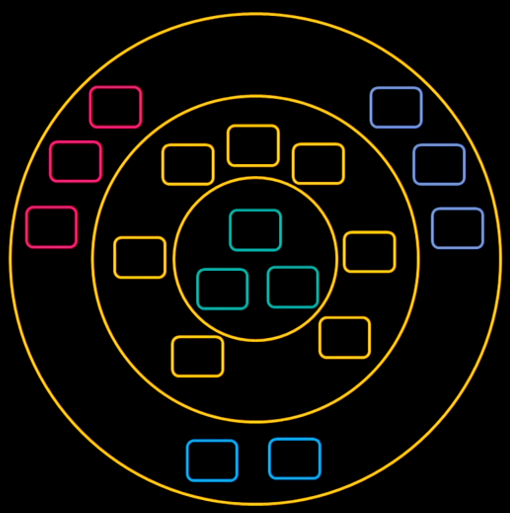

# Ports and Adaptors (a.k.a hexagonal architecture, a.k.a onion architecture)

# Resources

-   [Plugin systems - when and why - dev.to](../sources/Plugin systems - when and why - dev.to/Plugin systems - when and why - dev.to.md) 
-   [Functional architecture - The pits of success - Mark Seemann](../sources/Functional architecture - The pits of success - Mark Seemann/Functional architecture - The pits of success - Mark Seemann.md) 

