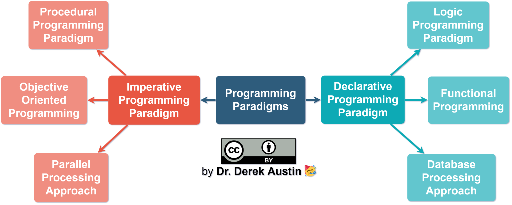

# Programming paradigms

- imperative paradigms - in which the programmer instructs the machine how to change its state
  - procedural - which groups instructions into procedures
  - object oriented - which groups instructions together with the part of the state they operate on
- Declarative paradigms - in which the programmer merely declares properties of the desired result, but not how to compute it
  - functional - in which the desired result is declared as the value of a series of function applications
  - Logic - in which the desired result is declared as the answer to a question about a system of facts and rules
  - mathematical - in which the desired result is declared as the solution of an optimization problem

Symbolic techniques such as reflection, which allow the program to refer to itself, might also be considered as a programming paradigm.

## Characteristics of declarative (functional) programming

- You declare what you want to happen, not how it’s done.
- There are no loops or conditional statements (for a set-based language, like  SQL, where you think of data in columns instead of in rows).
- There are plenty of filters and operations on the data as a whole, but the data is often considered immutable values

## Characteristics of imperative (procedural / OOP) programming

- You specify exactly how to do something, not just the desired outcome.
- Variables, pointers, and stored procedures are commonplace, and data is often considered mutable variables (changeable)
- Inheritance is commonplace and typically used as an example of reusable, clean code that helps future developers

### Table of terms actoss procedural and OOP

| Procedural     | Object-oriented |
| -------------- | --------------- |
| procedure      | method          |
| record         | object          |
| module         | class           |
| procedure call | message         |

## Procedural programming

The spirit of the procedural programming is to represent the business logic as a series of computational steps to be carried out. Procedural programming typically involves your code executing at the top of your script and going in order, statement by statement, to the  bottom.

Often, the terms "procedural programming" and "imperative programming"  are used synonymously. However, procedural programming relies heavily on blocks and scope, whereas imperative programming as a whole may or may not have such features. As such, procedural languages generally use reserved words that act on blocks, such as if, while, and for, to implement control flow, whereas non-structured imperative languages use goto statements and branch tables for the same purpose.

## Object-oriented programming

The focus of procedural programming is to break down a programming task into a collection of variables, data structures, and subroutines, whereas in object-oriented programming it is to break down a programming task into objects that expose behavior (methods) and data (members or attributes) using interfaces. The most important distinction is that while procedural programming uses procedures to operate on data structures, object-oriented programming bundles the two together, so an "object", which is an instance of a class, operates on its "own" data structure.

## Functional programming

A style of building the structure and elements of computer programs—that treats computation as the evaluation of mathematical functions and avoids changing-state and mutable data. It is a declarative programming paradigm in that programming is done with expressions or declarations instead of statements.

In functional code, the output value of a function depends only on its arguments, so calling a function with the same value for an argument always produces the same result. This is in contrast to imperative programming where, in addition to a function's arguments, global program state can affect a function's resulting value.

One of the key motivations for the development of functional programming is making a program easier to understand by eliminating changes in state that do not depend on function inputs which are called side effects.

# Resources

- [An overview of programming paradigms](../sources/An overview of programming paradigms/An overview of programming paradigms.md)
- [What Are JavaScript Programming Paradigms](../sources/What Are JavaScript Programming Paradigms/What Are JavaScript Programming Paradigms.md)
- [Functional vs Procedural JavaScript](../sources/Functional vs Procedural JavaScript/Functional vs Procedural JavaScript.md)

