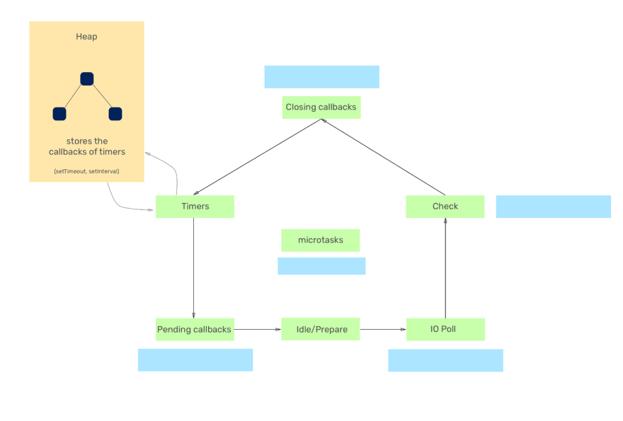
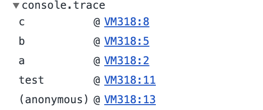
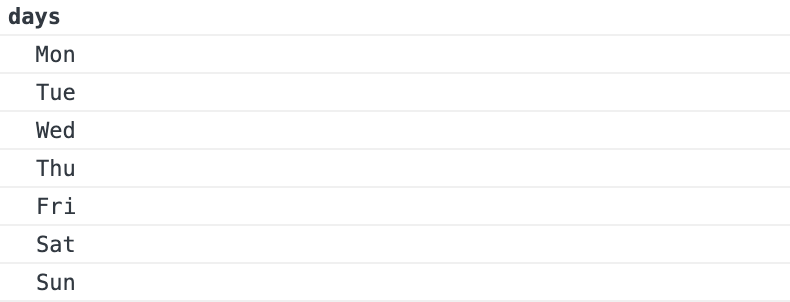
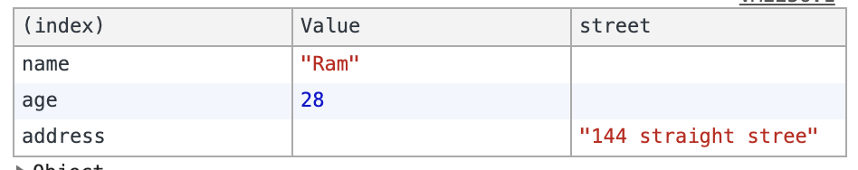

# Language features

1. Arrows: These are a function which is described by the ‘=>’ syntax
2. Objects: Object literals are used to support the prototype assignments.
3. Classes: ES6 classes can be easily implemented over the prototype based object oriented pattern
4. Destructing: It allows binding pattern which is based primarily on the pattern matching.
5. String interpolation
6. Default - default values to function arguments
7. Spread
8. Module Loaders
9. Weak set - collections of objects only and not of arbitrary values of any type. References to objects in the collection are held weakly. If there is no other reference to an object stored in the WeakSet, they can be garbage collected. That also means that there is no list of current objects stored in the collection. WeakSets are not enumerable.
10. Map
    1. Difference between Map & play object used for key/value
       1. Accidental Keys
          1. Map: A `Map` does not contain any keys by default. It only contains what is explicitly put into it.
          2. Plain Object: An `Object` has a prototype, so it contains default keys that could collide with your own keys if you're not careful.
       2. Key Types
          1. Map: A `Map`'s keys can be any value (including functions, objects, or any primitive).
          2. Plain Object: The keys of an `Object` must be either a [`String`](https://developer.mozilla.org/en-US/docs/Web/JavaScript/Reference/Global_Objects/String) or a [`Symbol`](https://developer.mozilla.org/en-US/docs/Web/JavaScript/Reference/Global_Objects/Symbol).
       3. Key Order
          1. Map: The keys in `Map` are ordered. Thus, when iterating over it, a `Map` object returns keys in order of insertion.
          2. Plain Object: The keys of an `Object` are not ordered
       4. Size
          1. Map: The number of items in a `Map` is easily retrieved from its [`size`](https://developer.mozilla.org/en-US/docs/Web/JavaScript/Reference/Global_Objects/Map/size) property.
          2. Plain Object: The number of items in an `Object` must be determined manually
       5. Iteration
          1. Map: A `Map` is an [iterable](https://developer.mozilla.org/en-US/docs/Web/JavaScript/Guide/iterable), so it can be directly iterated.
          2. Plain Object: Iterating over an `Object` requires obtaining its keys in some fashion and iterating over them.
       6. Performance
          1. Map: Performs better in scenarios involving frequent additions and removals of key-value pairs.
          2. Plain Object: Not optimized for frequent additions and removals of key-value pairs.
11. Promises
12. Proxies
13. Multiline string literals

# Event loop

The event loop is basically a mechanism which has certain phases through which it iterates



## Phases

- Timers - The callbacks of timers in JavaScript(setTimeout, setInterval) are kept  in the heap memory until they are expired. If there are any expired  timers in the heap, the event loop takes the callbacks associated with  them and starts executing them in the ascending order of their delay  until the timers queue is empty. However, the execution of the timer  callbacks is controlled by the *Poll* phase of the event loop (we will see that later in this article).
- **Pending callbacks** - In this phase, the event loop executes system-related callbacks if any.  For example, let's say you are writing a node server and the port on  which you want to run the process is being used by some other process,  node will throw an error `ECONNREFUSED`, some of the *nix  systems may want the callback to wait for execution due to some other  tasks that the operating system is processing. Hence, such callbacks are pushed to the pending callbacks queue for execution.
- **Idle/Prepare** - In this phase, the event loop does nothing. It is idle and prepares to go to the next phase.
- **Poll** - This phase is the one which makes Node.js unique. In this phase, the  event loop watches out for new async I/O callbacks. Nearly all the  callbacks except the setTimeout, setInterval, setImmediate and closing  callbacks are executed. Basically, the event loop does two things in this phase:
  - If there are already callbacks queued up in the poll phase queue, it will execute them until all the callbacks are drained up from the poll  phase callback queue.
  - If there are no callbacks in the queue, the event loop will stay in  the poll phase for some time. Now, this 'some time' also depends on a  few things:
    - If there are any callbacks present in the setImmediate queue to be  executed, event loop won't stay for a much longer time in the poll phase and will move to the next phase i.e Check/setImmediate. Again, it will  start executing the callbacks until the Check/setImmediate phase  callback queue is empty.
    - The second case when the event loop will move from the poll phase is when it gets to know that there are expired timers, the callback of  which are waiting to be executed. In such a case, the event loop will  move to the next phase i.e Check/setImmediate and then to the Closing  callbacks phase and will eventually start its next iteration from the  timers phase.
- **Check/setImmediate** - In this phase, the event  loop takes the callbacks from the Check phase's queue and starts  executing one by one until the queue is empty. The event loop will come  to this phase when there are no callbacks remaining to be executed in  the poll phase and when the poll phase becomes idle. Generally, the  callbacks of setImmediate are executed in this phase.
- **Closing callbacks** - In this phase, the event loop executes the callbacks associated with the closing events like `socket.on('close', fn)` or `process.exit()`

# for await...of

```javascript
async function* asyncGenerator() {
  let i = 0;
  while (i < 3) {
    yield i++;
  }
}

(async function() {
  for await (let num of asyncGenerator()) {
    console.log(num);
  }
})();
```

```javascript
const promises = [Promise.resolve(1), Promise.resolve(2), Promise.resolve(3)];

(async function() {
  for await (let num of promises) {
    console.log(num);
  }
})();
```

# Console

## console.log(messages)

Outputs a message(variable) to the web console.

```javascript
console.log("hello");
// hello

var a =10;
console.log(a);
// 10

var b = 20;
console.log(a, b);
// 10, 20

// we can also evaluate expression 
console.log(a+b);
30console.log(`${a} + ${b} = ${a+b}`);
// 10 + 20 = 30

var obj = {name : "Javascript Jeep"};
console.log(a, b, obj)
// 10 20 {name: "Javascript Jeep"}
```

## console.clear()

This will remove all the console message and prints Console was cleared.

## console.assert(condition, failure message)

The console.assert method is an easy way to run simple assertion tests.

```javascript
var a = 10;
console.assert(a === 10, "This will not be printed");console.assert(a != 10, "this will be printed", `a = ${a}`);
// Assertion failed: this will be printed a = 10
```

## console.count()

Logs the number of times that this particular call to count() has been called.

```javascript
function test() {
  console.count();
}
test(); // default : 1 
test(); // default : 2
test(); // default : 3

// Example 2 :
// We can also use label to itfunction test(label) {
  console.count(label);
}
test("Times"); // Times: 1
test("Num"); // Num: 1test("Times"); // Times: 2
test("Num"); // Num: 2test("Times"); // Times: 3
test("Num"); // Num: 3
```

## console.countReset()

Resets the counter. This function takes an optional argument label.

```javascript
console.count(); // default: 1
console.count(); // default: 2
console.count(); // default: 3
console.countReset();
console.count(); // default: 1
console.count("time"); // time: 1
console.count("time"); // time: 2
console.count("time"); // time: 3
console.countReset();
console.count("time"); // time: 1
```

## console.info()

Prints a message to the console.

## console.warn()

Outputs a warning message to the console.

## console.error()

Outputs an error message to the console.

## console.trace()

Output the stack trace to the current function to the console.

```
function a() {
   b();
}
function b() {
   c() 
}
function c() {
  console.trace()
}
function test() {
  a();
}
test()
```



## console.dir()

prints out objects in a nice formatted way

## console.dirxml()

It prints out a DOM element’s markup.

```javascript
console.dirxml(document.body);
// this will display body of the html element
```

## console.time(label) and console.timeEnd(label)

We can start a timer with `console.time` and then end it with `console.endTime`. By using this we can find the time taken to execute a function.

```javascript
function a () {
	for(let i = 0 ;i < 10000; i ++) {
       // operation;
  }
}
console.time();
a();
console.timeEnd();  // default: 0.18896484375msconsole.time("test");
a();
console.timeEnd("test"); // test: 0.35302734375ms
```

## Grouping console messages

```javascript
console.group("days")
  console.log("Mon");
  console.log("Tue");
  console.log("Wed");
  console.log("Thu");
  console.log("Fri");
  console.log("Sat");
  console.log("Sun");
console.groupEnd("days")
```



# console.table(obj)

This prints the objects in table format

```javascript
var user = {
    name : "Ram",
    age : 28,
    address : {
      street : "144 straight stree"
    }
}
console.table(user);
```



# Resources

-  [for await...of](https://developer.mozilla.org/en-US/docs/Web/JavaScript/Reference/Statements/for-await...of)
-  [Console cheat sheet for JavaScript developers](https://levelup.gitconnected.com/console-cheat-sheet-for-javascript-developers-21f0c49604d4)
- [Synchronous Iterators](https://dev.to/jfet97/javascript-iterators-and-generators-synchronous-iterators-141d)
- [Synchronous Generators](https://dev.to/jfet97/javascript-iterators-and-generators-synchronous-generators-3ai4)
- [Asynchronous Iterators](https://dev.to/jfet97/javascript-iterators-and-generators-asynchronous-iterators-28b8)
- [Asynchronous Generators](https://dev.to/jfet97/javascript-iterators-and-generators-asynchronous-generators-2n4e)
- [Understanding the Node.js event loop phases and how it executes the JavaScript code.md](../sources/Understanding the Node.js event loop phases and how it executes the JavaScript code/Understanding the Node.js event loop phases and how it executes the JavaScript code.md)
- [Difference Between ES6 vs ES5.md](../sources/Difference Between ES6 vs ES5/Difference Between ES6 vs ES5.md)

# External resources

- [[MDN] Map](https://developer.mozilla.org/en-US/docs/Web/JavaScript/Reference/Global_Objects/Map)

