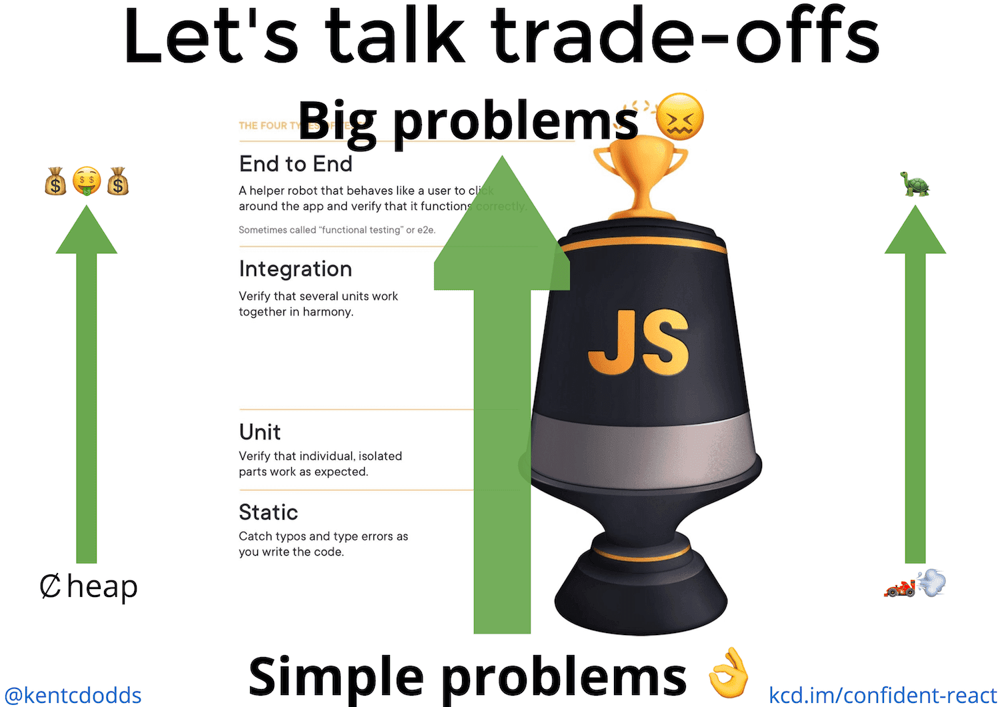

# Testing types

- **End to End**: A helper robot that behaves like a user to click around the app and verify that it functions correctly. Sometimes called "functional testing" or e2e - can be manual or automated
- **Integration**: Verify that several units work together in harmony.
- **Unit**: Verify that individual, isolated parts work as expected.
- **Static**: Catch typos and type errors as you write the code.

# Why do we test?

The biggest and most important reason that I write tests is **CONFIDENCE**. I want to be confident that the code I'm writing for the future wont break the app that I have running in production today. So whatever I do, I want to make sure that the kinds of tests I write bring me the most confidence possible and I need to be cognizant of the trade-offs I'm making when testing.

# Trade-offs

# 

## Cost: ￠ heap ➡ 💰🤑💰

As you move up the testing trophy, the tests become more costly. This comes in the form of actual money to run the tests in a continuous integration environment, but also in the time it takes engineers to write and maintain each individual test.

## Speed: 🏎💨 ➡ 🐢

As you move up the testing trophy, the tests typically run slower. This is due to the fact that the higher you are on the testing trophy, the more code your test is running. Unit tests typically test something small that has no dependencies or will mock those dependencies (effectively swapping what could be thousands of lines of code with only a few). **Keep this in mind because it's important** #foreshadowing...

## Confidence: Simple problems 👌 ➡ Big problems 😖

We write software that tests our software. And the trade-off we're always making when we do that is now our tests don't resemble the way our software is used as reliably as when we had Aunt Marie testing our software. But we do it because we solve real problems we had with that approach. And that's what we're doing at every level of the testing trophy.

**As you move up the testing trophy, you're increasing what I call the "confidence coefficient."** This is the relative confidence that each test can get you at that level.

Remember two things:

> - The higher up the trophy you go, the more points of failure there are and therefore the more likely it is that a test will break
> - Unit tests typically test something small that has no dependencies or will mock those dependencies (effectively swapping what could be thousands of lines of code with only a few).

In particular, static analysis tools are incapable of giving you confidence in your business logic. Unit tests are incapable of ensuring that when you call into a dependency that you're calling it appropriately (though you can make assertions on how it's being called, you can't ensure that it's being called properly with a unit test). UI Integration tests are incapable of ensuring that you're passing the right data to your backend and that you respond to and parse errors correctly. End to End tests are pretty darn capable, but typically you'll run these in a non-production environment (production-like, but not production) to trade-off that confidence for practicality.

# Where do you start?

- Step 1 - Setup Static Tools (Eslint, Prettier, Typescript/Flow)
- Step 2 - Make a single E2E test
- Step 3 - Write a single unit test
- Step 4 - Write more tests
- Step 5 - Teach your whole team how to test

# Common testing mistakes

- Testing Implementation Details -  Why is it so bad to test implementation details? Here are two truths about tests that focus on implementation details like the test above:
  1. I can break the code and not the test (eg: I could make a typo in my button's onClick assignment)
  2. I can refactor the code and break the test (eg: I could rename increment to updateCount)
- Mistake Number 2: 100% code coverage - Trying to go for 100% code coverage for an application is a total mistake. Interestingly I've normally seen this as a mandate from management, but wherever it's coming from it's coming out of a misunderstanding of what a code coverage report can and cannot tell you about the confidence you can have in your codebase.

E2E tests may be slower and more expensive than unit tests, but they bring you much more confidence that your application is working as intended.

# Code coverage

## What is it?

> In computer science, test coverage is a measure used to describe the  degree to which the source code of a program is executed when a  particular test suite runs.

As its defined here, test coverage does not tell us which lines in  the code have been tested. It does not tell us whether all possible  conditions have been tested. It only tells which lines of code were  executed during a test run.

The definition makes no mention of quality, though it does go on to talk about bugs.

> A program with high test coverage, measured as a percentage, has had  more of its source code executed during testing, which suggests it has a lower chance of containing undetected software bugs compared to a  program with low test coverage.

This idea presented is that more coverage correlates with fewer bugs.  Correct or not, this is not the same as using coverage as a tool to find existing bugs or preventing bugs from making it to production. It only  tells us there is a lower chance of bugs because of the test coverage.

## The Reason Test Coverage Lies

Let’s look at a short example to see how test coverage gives us a false  sense of how well-tested our code is. Consider the code below. It has  four branches to test.

```javascript
// This function always returns 12
// ...or does it?
exports.alwaysTwelve = function(a, b) {
  let y, z;

  if (a === true) y = 4;
  else y = 6;

  if (b === true) z = 3;
  else z = 2;

  return y * z;
}
```

And here are some tests for it.

```javascript
const assert = require('assert');
const { alwaysTwelve } = require('.');

describe('Always Twelve', function () {
  context('when true', function () {
    it('returns 12', function () {
      const value = alwaysTwelve(true, true);
      assert.equal(value, 12);
    });
  });

  context('when false', function () {
    it('returns 12', function () {
      const value = alwaysTwelve(false, false);
      assert.equal(value, 12);
    });
  });
});
```

The code and tests above result in 100% test coverage because the two tests are enough to cover the four branches in the code. However, they  are not enough to cover all possible paths through the application code. They don’t help us catch an obvious bug in the logic of our code.

## What This Tells Us About Test Coverage

There are some unfortunate conclusions we can take from these examples.

1. **Executed and tested are two different concepts**. While we may know what code executed through test coverage, it doesn’t mean those lines are properly tested or tested at all.
2. **The percentage is a best case scenario**. If the test coverage says 80%, that tells us between 0-80% of the code is properly tested.
3. **Once a line of code is marked as covered, it ceases to be a helpful designation**. As shown above, unless we know why a line of code is considered covered, we can’t say it’s been properly tested.
4. **The number of lines unexecuted is the only useful metric**. This measurement can tell us what code needs tests or what areas of  code are weak on testing. The percentage of test covered tells us little more than which code was executed, which has some value but not much.  It's only useful in telling us what code wasn't executed.

Test coverage doesn’t help us improve code quality, explore the  design of our code, discover bugs, prevent bugs, or test the logic of  the code. It can only tell us that our code executed without errors with the inputs we gave it. That’s it really. That’s all we get from test  coverage. Maybe that’s worth something.

If we notice that one codebase is consistently dropping in coverage,  we can take that as a sign to look a little deeper into what's going on. Is the codebase incredibly hard to test? Are the developers just not  putting forth the effort to test, even when it makes sense?

## Good testing starts with good software architecture

Gary Bernhardt defines two categories of code. One category contains all of the  paths and conditionals but has no dependencies. This category of code  includes business logic and policies but doesn’t access the outside  world like databases, the internet, or disks. It lends itself well to  isolated unit testing, and it allows developers to test all possible  paths quickly (because 2n tests adds up). He calls the category the functional core.

The other category of code contains almost no paths yet defines all  of the dependencies. This category lends itself well to integration  testing since integration tests wire together databases, internet, and  disks and ensure they work. He calls this category the imperative shell.

With these categories in mind, we can look at code and look at  whether there are outside dependencies and whether all paths are  well-tested. We can write many fast unit tests since the paths are  isolated from the outside world and a few integration tests to ensure  the world is wired together correctly.

Therefore, code reviewers can move from relying on test coverage to thinking about paths and dependencies.

1. Have we introduced a dependency where it shouldn’t be?
2. Have we added paths in our code where they shouldn’t be?
3. Are we testing all of the conditionals in the code?
4. Are we writing small functions so we can reduce our testing surface area and create solid boundaries?

# Test Double types

## Fake

Objects that actually have working implementations, but usually take some shortcut which makes them not suitable for production. Ex: inmemory database which is not resilent to crashes

## Stubs

They provide canned answers to calls made during the test, usually not  responding at all to anything outside what's programmed in for the test. Stubs may also record information about calls, such as an email gateway stub that remembers the messages it 'sent', or maybe only how many  messages it 'sent'.

## Mocks

Objects pre-programmed with  expectations which form a specification of the calls they are expected  to receive.

# Resources

-  [How to add testing to an existing project](../sources/How to add testing to an existing project/How to add testing to an existing project.md)
-  [Eliminate an entire category of bugs with a few simple tools](../sources/Eliminate an entire category of bugs with a few simple tools/Eliminate an entire category of bugs with a few simple tools.md)
-  [Common Testing Mistakes](../sources/Common Testing Mistakes/Common Testing Mistakes.md)
-  [Write tests. Not too many. Mostly integration](../sources/Write tests. Not too many. Mostly integration/Write tests. Not too many. Mostly integration.md) 
-  [Static vs Unit vs Integration vs E2E Testing for Frontend Apps](../sources/Static vs Unit vs Integration vs E2E Testing for Frontend Apps/Static vs Unit vs Integration vs E2E Testing for Frontend Apps.md)
-  [Test Coverage is a Lie](../sources/Test Coverage is a Lie/Test Coverage is a Lie.md) 
-  [Code Coverage is Useless](../sources/Code Coverage is Useless/Code Coverage is Useless.md) 
-  [A bug was found in Java after almost 9 years of hiding](../sources/A bug was found in Java after almost 9 years of hiding/A bug was found in Java after almost 9 years of hiding.md) 
-  [Functional architecture - The pits of success - Mark Seemann](../sources/Functional architecture - The pits of success - Mark Seemann/Functional architecture - The pits of success - Mark Seemann.md) 
